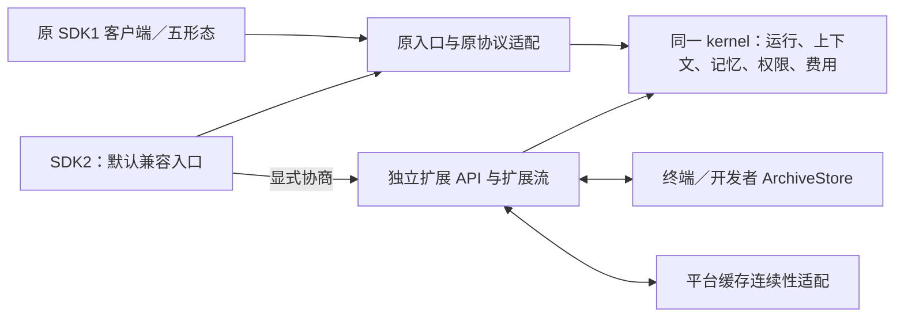

# RFC-SDK2-1：兼容 SDK1 的 SDK2 扩展协议

创建：2026-09-15。更新：2026-09-24。**v0.7 兼容合同定版**，SDK2 总方案 v0.4。任务：SDK2-01b，父卡 SDK2-01。原五条合同完成条件已会签，当前 SDK1 未解释的不兼容设计项为 0，定版对应见 §11。合同完成不代表 SDK2-03／05／09、全部 S0／S3、发行或主线 CI 完成；各项实施与实证仍按原计划、验收单登记。

历史 v0.6 截面（2026-09-23，保留 v0.5 基线）：原§9档案／材料及wire切面已交叉复核，66项合同测试通过；split-receipts-v1修订另有74项合同／wire测试通过（含原66项），不等于产品交接。该截面记录“新模式／缓存合同及完整S0未完成”。此后 §10.1～10.6 与独立缓存合同补齐了新族、协商、来源、网关及回滚边界；不得将历史阶段状态再次解释为当前合同未定，也不把这些合同测试迁记为全部产品已验。

前置：[SDK1 协议锁定与兼容矩阵](../report/SDK2.0-SDK1协议锁定与兼容矩阵-2026-09-15.md)。范围：[SDK2 主方案](../report/SDK2.0-会话档案与上下文材料供给方案-2026-09-14.md)及其[缓存子案](../report/SDK2.0-跨端上下文与缓存连续性子方案-2026-09-15.md)。执行：[开发计划](../report/SDK2.0-开发计划与执行清单-2026-09-14.md)；验收：[S2A](../report/SDK2.0-对抗式验收单-2026-09-14.md)。运行身份及执行隔离消费原 [USDK RFC](RFC-USDK-1-运行端与终端执行契约.md)。

**已确定的规范：SDK2 = 完整保留的 SDK1 兼容面 + 显式选择的新扩展面。** 本 RFC 会签可以细化新 API，不能批准对 SDK1 旧 API 的不兼容替换。§1～8 保留起草时的候选与准入表述；其具体合同由后续 §9～11 及具名引用定版，未实现能力仍不能宣告支持。不提高旧 `contractVersion`，不修改冻结 L0。

## 1. 总体结构



保留 `/v1`、`/v2/sessions`、TWP 与既有 SDK 调用。新增候选命名空间为 **`/v3/sdk2`**，扩展合同标识 **`sdk2-ext-v1`**；`/v3` 仅表示独立新 wire 面，SDK2 代际不等于强制迁移所有调用到 `/v3`。历史 v0.5 的“当前源码没有该路由实现”只适用于当时冻结的源码；截至 `cec9c0ec`，`packages/server/src/sdk2/archive-http.ts`、`packages/api-client/src/sdk2/http-client.ts` 及其测试已提供局部路由／客户端实现，但仍受未发布、父门未闭和跨端组合缺口约束，不能据此宣称 `/v3/sdk2` 全面支持。候选路径在 01b 会签时一次定版，不在实现中分叉成多个别名。

SDK 新增扩展客户端／存储接口作为独立命名的导出或子入口，具体导出路径随 01b 固定。旧 `query`、`createSession`、`runAgent`、SessionStore 和已有事件联合类型保持原签名及默认路径，不把旧返回值改成新旧两种不兼容的联合。Android／Swift 同样新增独立类型；不能为复用名字修改旧类的构造和 ABI。

新旧协议适配接入同一运行、调度、压缩、记忆、权限和计量实现。允许 DTO／序列化边界不同，不允许新建第二个 agent loop 或第二套权威历史、审批、预算与操作账本。

现有历史持久化是SDK2继续维护的正式能力，新应用也可直接使用。SDK宿主本地／自定义Store和serve服务端Store保持原支持范围；未启用扩展时原默认配置、保存位置、提交／读取／恢复行为不变，原不落盘用法也不被静默开启持久化。ArchiveStore是独立可选扩展，不是替代SessionStore的强制下一版本。关闭终端档案能力不能连带关闭现有持久化。

## 2. 能力发现与显式协商

### 2.1 发现

候选 `GET /v3/sdk2/capabilities`：只读、经过宿主认证，不创建会话、不预占费用、不启动模型。响应给出可识别的协议标识、支持的精确版本、能力及限值。能力支持与当前用户／应用授权是两件事，真正使用时仍按既有可信配置复验。

候选能力名为 `archive-transfer-v1`、`context-materials-v1`、`cache-continuity-v1`。档案记录、材料来源和缓存组分别协商；实现尚未完成的能力不能对外宣告。持久承诺另外说明持久落点与等级，不用一个 `durable: true` 隐去“serve、终端还是共享副本”。

发现返回的限值必须是有限值，覆盖记录／批次字节、页数、并发材料请求、待确认容量／时长、附件大小及扩展流保留窗；01b 固定首版默认值和合法范围。遗漏／未知的必需限值不能解释为无限。客户端可以申请更低范围，不能自己提高宿主额度。

### 2.2 绑定

候选 `POST /v3/sdk2/bindings` 请求包含：

- `protocol: "sdk2-ext-v1"`、`requestId`、目标 `sessionId` 及期望的会话／历史代际。
- 精确的 `requiredCapabilities` 和 `optionalCapabilities`；可选项是否接受不用新能力，由开发者显式决定。
- 请求的档案策略及已授权来源引用；客户端 OS／设备能力是适配信息，不是权限依据。

服务端成功响应明确给出 `bindingId`、接受和拒绝的能力／原因、来源／代际、实际限值及保留策略。required 中任一项不能满足则整体拒绝，不创建半有效绑定。绑定与起轮／关闭共享会话排他边界：首版只在空闲安全点原子生效；运行中返回新扩展的冲突错误，不取消或重启原轮，不暗改当前轮材料。

`requestId` 的幂等范围绑定可信主体、目标资源、协议版本和请求内容见证；同 ID 同内容重试返回同一结果，不同内容冲突。身份、成员关系、应用能力在重试／读取时仍复验，幂等不能绕过撤权。幂等记录保留期、过期后处理和状态查询在 01b 固定。

### 2.3 不支持与故障

新 SDK 不申请扩展时直接使用旧入口，旧 serve 无需实现发现接口。申请必需扩展时，只有可识别的新协议响应才能确认为支持或不支持；未知 404、代理页、超时、401／403、5xx 不能猜成旧服务并自动降级。连发现响应都没有时报告“扩展能力未确认”，旧会话可以保持原状态，不能把新功能记成成功。

只有已认证且可识别的发现／协商结果明确拒绝某可选能力，并且开发者预先允许不使用该能力，才继续其余已接受能力或明确的旧模式。任何模型／工具／费用副作用启动后禁止自动 cancel＋重发、create＋回填或上传全史重试。协商失败不能放宽认证、审批、数据保留或宿主工具隔离。

## 3. 兼容会话与独立新会话

### 3.1 在旧会话上扩展

通过原 `POST /v2/sessions` 创建的资源永久保持 SDK1 会话合同。可绑定档案旁路捕获、独立材料查询和已协商缓存观察，但所有旧 `get/history/messages`、默认事件、关闭及恢复行为必须仍可兑现。新旧客户端共同观察／使用该会话时，扩展流不会注入旧流，也不强迫旧客户端补 ACK 或更换初始化流程。

释放归档原文不得释放仍属于**当前有效历史**或原读取合同所需的数据。若终端离线会导致旧 history 不完整，则该存储策略不能绑定旧会话；服务端在绑定时拒绝该模式，而不是运行后把旧 API 改成返回残缺历史、502 或新语义错误。

叠加档案时，原Store仍按原语义提交和恢复；档案ACK只影响其负责的副本／待确认数据，不改旧commit／drain／flush的责任。两边完成状态分别可查询：任一失败不能伪装另一边成功，也不能撤销已提交的原历史。对承诺完整归档的扩展，超时／积压按已协商边界背压，不能无限重试或丢档；未绑定扩展的会话不等待这条确认链，队列／资源按原宿主隔离治理。

协议绑定／关闭默认不移动、删减原Store数据或缩短其保留期限。旧关闭、Store删除、档案副本删除及新模式转换须分别执行明确范围，不新增跨SessionStore／Archive的隐式级联；原Store内部已有的副本、附件及同居快照删除合同不变。转换回原持久化必须先确认旧读取所需的有效历史已完整、可读且来源可信，失败保留原数据／状态；不存在“翻开关即保证可回滚”的承诺。

### 3.2 无法保留旧读取可用性的模式

“仅终端保管、核心按需取材、材料离线时必须等待”的模式具有不同可用性合同。若无独立可靠来源可以继续履行旧历史接口，它使用候选 **`POST /v3/sdk2/sessions`** 创建独立、显式选择的新模式资源；不能把既有 `/v2` 会话原地升级成旧客户端不认识的类型。

这类资源在新命名空间有独立的 session view、messages／inputs、cancel／close 和事件适配，内部调用同一核心原语。需要新增可用性字段的视图留在新 API，不向旧 session list 混入新类型。旧会话仍全部可见／可用；新模式资源不冒充旧路由所属资源，访问遵守原路由的资源查找／错误边界。新资源仍参与可信主体的全局并发、费用及容量约束，不能靠另一命名空间绕过限额。

隔离必须落在持久注册及恢复查找层：为新模式资源保存不可变的合同族／模式标记，具体字段由01b会签；既有记录缺标记按旧合同解释。旧create的resume、fork、checkpoint、history、list及冷恢复路径均不得把新模式装入旧reader，不能仅在HTTP路径上分流。回滚旧程序前必须保持独立存储隔离或兼容路由层，避免旧程序扫描到新卷；不能靠旧代码尚不认识的新字段自行保证隔离。

这是“不兼容功能另写新 API”的边界，不代表旧 SDK 能使用它本来没有的 SDK2 功能。SDK2 默认入口仍创建旧合同会话；采用新模式必须是开发者明确动作。首版如果不交付新模式，应把对应策略标为未支持，不以临时弱化旧 history 合同代替实现。

## 4. 扩展数据面

以下是供会签的最小操作集合。路径均在 `/v3/sdk2` 下；记录和材料 DTO 在独立扩展 schema 内定义，不塞进冻结 IR／KernelEvent。

| 候选操作 | 作用与语义 |
|---|---|
| `GET /bindings/:id` | 查询接受的合同、状态、代际及限值；重试／恢复前对账 |
| `GET /bindings/:id/events` | 独立扩展 SSE；以扩展流自己的 cursor 重放，不改变旧 SSE 的 seq |
| `GET /bindings/:id/archive/records` | 按档案游标读取有界记录／完整轮关系；缺口、来源不可用和本来为空分别表达 |
| `POST /bindings/:id/archive/acks` | 终端／约定副本在事务提交后确认连续覆盖、记录见证和附件状态；不是执行审批 |
| `GET /bindings/:id/archive/status` | 查询已发布、各来源确认及可释放水位；ACK 结果未知时用于对账 |
| `POST /bindings/:id/material-responses` | 响应核心发出的有 ID、范围、期限和预算的材料请求；未经请求的内容按导入候选处理，不能冒充历史事实 |
| `POST /bindings/:id/projection-restores` | 提交核心生成的有效投影引用／版本供验证；不允许客户端直接确立摘要或强行替换有效历史 |
| `POST /bindings/:id/cache-continuity` | 绑定可信逻辑对话引用、投影代际和缓存分组请求；分组由平台确定，不接受客户端指定上游凭据／路由 |
| `GET /bindings/:id/cache-observations` | 权限控制下的有界脱敏观察；区分来源实报／推测／未知，不承诺命中 |
| `POST /bindings/:id/archive/deletions` | 显式删除范围、代际和幂等 ID；产生墓碑／状态，不调用旧 DELETE 伪装全域删除 |
| `POST /bindings/:id/close` | 停止新增扩展工作并对账已接纳记录；有未交接数据时不能静默删队列或声称可回滚 |

服务端权威捕获档案记录，终端保存后 ACK；同步／导入来源可经材料通道供给，但不能通过任意 append 伪造曾经执行的工具结果。存储适配可有内部 append/read 方法，不能把内部权威 append 直接暴露成不受约束的公共写历史接口。

扩展帧的必要头为协议版本、`bindingId`、扩展事件 ID／游标、资源代际、事件类型和 payload。运行 `sessionId`、`turnId`、档案记录序、材料请求 ID、有效投影 revision 各有独立字段；适用时引用原运行 ID，不改变其原含义。最终序列化类型及整数上限在 01b 由 TS／Kotlin／Swift 同源 schema 和边界夹具固定，不能各端自行解释超大整数。

收到高游标不代表中间完整；档案 ACK 需要连续覆盖证明，附件确认与正文确认分开。`received`、`durablyStored`、`coreConsumed` 是三个不同状态。终端 ACK 是存储承诺，不能证明恶意终端的物理磁盘；需要更强保证的应用配置独立耐久副本。待确认数据只能在来源策略、运行依赖和改写屏障都满足后释放。

旧 INJ 的 `ack=memory`、旧 `idle/ended`、已有 `drain/closeAsync` 和 SSE 语义全部保留；新接口不能把它们解释为上述扩展状态。

## 5. 上下文、身份、缓存和权限

材料包包含有界候选、来源／覆盖、摘要及有效投影版本引用；核心核对当前可信头、删除代际、工具配对、预算和准入后决定是否使用。旧摘要重放、导入编辑和历史 hash 不能获得系统提示词优先级、恢复审批或证明副作用已完成。原 P/S/A 刷新、压缩、microcompact、pinned 规则、长期记忆和同轮插入继续执行。

缓存连续性扩展区分连接、平台运行会话、逻辑对话、缓存分组和内容指纹。SDK1 未协商路径继续使用原 `cache.key` 来源、feature、重试字节和平台会话规则。新 feature 由 SDK／serve 与 API 网关两段均确认后才出线；serve 支持不代表旧 API 网关支持。必要新 feature 未确认则拒绝该请求，可选缓存优化可在预先选择的边界内冷运行；认证／权限异常不能冷回落绕过。

缓存组不成为身份、费用、运行租约或幂等账本。410 归档、真正新建、fork、导入、切模及撤权按已有边界处理，不能为缓存复活过期会话、复用工具审批或无限保活。缓存优化服从当前提示词、能力、模型和健康规则；对上游不能保证 KV 可移植或必然命中。

所有存储来源按可信应用／用户／资源授权核查，不接受任意 serve 宿主路径、模块名或绕过出站规则的 URL。客户端平台信息只决定适配，不授予宿主工具能力。USDK 执行器与操作账本继续是对应权威，SDK2 不建立旁路。ACP 和 headless 的扩展分别使用显式协商的独立命名空间／输出模式，默认协议和 stdout 不插入 SDK2 新帧。

## 6. 新错误与新数据格式

扩展采用独立错误包络，至少包括协议版本、稳定机器码、requestId、是否可安全重试及可公开细节。候选码覆盖 `unsupported_capability`、`protocol_version_mismatch`、`capability_unconfirmed`、`binding_conflict`、`stale_generation`、`archive_gap`、`source_unavailable`、`invalid_coverage`、`capacity_exceeded`、`request_id_conflict`；HTTP 映射、必填字段、长度和重试规则在 01b 定版。旧 API 不返回这些新码或改变旧包络来承载它们。

扩展解析器忽略经 schema 允许的未知可选键；未知协议版本、必需能力、必需事件语义必须拒绝或停止该扩展，不推进 ACK。不能把“忽略未知”实现成丢弃记录后宣称完整。

新增 `ArchiveStore`／材料适配与旧五方法 `SessionStore` 并存。旧 `get/commit` 始终返回／接收完整的当前有效历史，原 rewritten、冷恢复及分页规则保留。扩展状态使用独立命名空间／版本标记，原卷不写入旧 reader 无法识别的新强制记录。旧数据迁移只能使用实际还存在的历史，原文缺失如实标记。

新模式会话的快照可以采用新格式，但不能交给旧 reader 猜读；回滚需要保留新读者或把新模式停在可恢复状态。关闭 feature 不等于抹掉已接纳记录、墓碑或未知副作用。

## 7. 发布与兼容判据

先完成 SDK2-01a 的固定基线和真正旧消费夹具，再会签本 RFC。扩展默认不启用，服务器先提供新旧并行协议，再由新客户端明确请求。滚动部署时支持集、路由与绑定元数据必须可核查；新请求不能被透明重试到不支持该能力的实例。关闭扩展前停止新绑定，并对账既有在途工作；仍需新 reader 的数据不能在回滚中丢给旧实现。

兼容验收按真实拓扑分别执行：旧Android／iOS和实际HTTP消费者×新serve；新远端客户端×旧serve；旧Node应用×新进程内SDK；旧Node SDK／API client×新API网关。不能把现有`@tansr/sdk`误当serve `/v2`客户端。此外覆盖关闭扩展、新旧客户端混用、自实现五方法Store、历史卷、严格解析器、原生接口／ABI及五形态。对应S2A-037～048，连同原36项合计48项。

旧已编译App保留原SDK连新服务时，不得被迫改代码、重编、补初始化或换认证；这是wire门。升级SDK库时，原公开调用／依赖／行为以及声明支持的JVM二进制、Swift稳定接口另过库兼容门；必要的正常编译／链接操作不等于调用方必须迁移源代码。显式使用SDK2新API需要开发者改代码和构建属于新能力消费，但不能损坏同宿主旧业务。

## 8. 会签与调整入口

| 必须在产品开工前定版的内容 | 责任／追溯 |
|---|---|
| SDK1 支持矩阵、固定旧消费物、原版金样可运行、自定义 Store／旧卷样本 | SDK2-01a；S2A-037／038／044／046／047 |
| 路由、扩展入口、协议 schema、整数／游标、错误与幂等完整定义 | SDK2-01b；S2-D10；S2A-039～043 |
| 兼容会话可用性证明、独立新模式首版是否交付及 API 完整 DTO | SDK2-01b；S2-D01／02／10；S2A-043／044 |
| 各策略耐久落点、保留上界、在途预留和离线期限 | SDK2-01；S2-D01～03；S2A-001～012 |
| TWP／API 扩展 feature、网关支持协商、缓存隔离和旧字节不变 | SDK2-01b／07；S2-D07／10；S2A-045 |
| 两案共享身份、内核入口及不支持实例隔离／滚动回滚 | SDK2-01／06；S2-D06／10；S2A-043／048 |

这些是有责任归属的会签项，不是允许实施时随意补定的默认值。新路径／字段变更须同步本扩展合同、矩阵、计划和验收；旧公开 API 的不兼容变更不能作为调整选项。历史首批准入仅覆盖02内部纯治理／容量原语；后续对应合同切面通过后逐批接线，当前定版状态由 §11 统一登记。该历史限制不撤销已通过会签的实现，也不提前放行未来未具名的新能力。

## 9. S1合同定版输入（2026-09-16）

本节将第一批实现限定为**保留当前持久化的单来源档案叠加**，不是删减完整SDK2范围。先建立可靠捕获、耐久交接和材料读取，再实施新卸载会话、同步／共享来源、缓存跨网关接线。未完成的能力不得出现在发现结果的支持列表，也不能把S1完成称为SDK2全部完成。

机读事实源为同目录 `sdk2-ext-v1.schema.json`，金样和反例由 `scripts/test/sdk2-extension-schema.test.mjs`消费；冻结前须核对schema、下面语义及实际序列化一致。JSON Schema负责结构／值域，不能代替跨请求的认证、连续覆盖、CAS、持久状态和资源上界验证。

### 9.1 S1能力与身份边界

S1保留`/v3/sdk2`和`sdk2-ext-v1`；只协商`archive-transfer-v1`与`context-materials-v1`，可用性固定`legacy-complete`。创建会话仍经旧入口；绑定不改变会话合同。`POST /v3/sdk2/sessions`、投影恢复、缓存连续性和跨来源删除在相应卡完成前不实现、不宣告，更不能用旧create模拟其成功。独立新会话完整DTO及持久隔离是该能力开工的追加门，原§3.2要求保持。

扩展认证复用USDK的可信应用域：`applicationScopeId`、原始`endUserId`、当前授权修订由宿主认证或固定单应用装配给出，不能来自请求体／查询参数／OS标签。单应用部署可固定映射应用域；多应用部署未提供可信映射就拒绝启用扩展。每次重试、查询和SSE重连均复验当下权限，幂等回执不延长授权。内部存储使用结构元组，不把应用域拼入平台的endUserId。

权限分别为绑定管理、档案读取／确认、材料响应和副本删除；均不蕴含execute、approve或平台计费权限。`sourceId`只能引用宿主已登记且属于当前应用／用户的来源。源码实现不得接受任意文件路径、模块／npm名或URL作为来源；新材料读取失败时也不得回落到serve本机工具。

共享serve的宿主硬隔离沿USDK strict合同实施。SDK2材料／档案模块只做宿主内部存储IO，不注册为模型的宿主读写／命令工具；其实现不能自行放宽旧入口装配。共享strict装配未通过USDK隔离门时，SDK2仅声明受信单应用宿主消费，不对外声称已获得共享平台安全保证。

### 9.2 编码、记录与权威性

长期档案序号、投影修订和删除代际使用无前导零的十进制字符串，范围`0…9223372036854775807`；字节数／数量／毫秒限值使用非负安全整数。旧sessionId／turnId保持不透明，禁止大小写折叠或Unicode规范化。新不透明ID只采用受限ASCII，不能将它当路径。

每条档案关联独立记录ID、连续序号、前驱摘要、历史代际、轮ID及正文摘要；附件引用有独立正文／附件确认状态。当前有效历史revision、运行事件seq、档案sequence、扩展SSE cursor、同轮inputId分别使用，不互换。来源端的高游标只能说明已收到某位置，不能证明中间完整。

控制元数据使用UTF-8、ASCII字段名、固定键序和有序数组，不做文本规范化；数值只允许安全的非负整数，拒绝负零、分数、指数写法、非法Unicode代理项及重复JSON键。原IR正文是不可变字节附件，保留其原始数字／JSON表示，不套用控制元数据限制或重新编码。JSON解码器如不能检测重复键，必须在控制字节入口另设严格解析；不能先JSON.parse丢掉冲突键再宣称验证了原输入。正文原字节摘要、完整记录链摘要与操作语义摘要分别使用明确的域；参考编码、请求映射和固定金样见[wire合同](SDK2-ext-v1-wire.md)。逐语言金样是发布门，不以类型编译代替。

服务器保留可信的连续头、当前投影revision和删除代际。材料只有与服务端已捕获的见证逐项匹配后才能成为`verified-history`；外部导入／编辑的内容属于candidate。终端声明的role、system提示词、tool结果或批准记录不能提升上下文优先级、证明执行完成或取得记忆准入。摘要／材料仅作核心上下文管理器的输入，不能再建一套端侧权威压缩或权限系统。

### 9.3 绑定、持久化与连续确认

绑定状态为`active → backpressured → active`，以及`active/backpressured → closing → closed`。绑定创建／变更必须和起轮共享同一会话排他边界，按expectedRevision比较并原子提交；运行中冲突不取消或重启原轮。closing停止新接纳，但继续提供已接纳记录查询和确认；未交接队列不能删掉并返回closed。

绑定前先通过只读`GET /sessions/:sessionId/binding-target`取得当前目标快照及绑定槽revision。目标包含当前历史代际、投影版本和宿主计算的sourceSnapshotDigest；即使尚无绑定、槽revision仍为0，旧会话历史改写也会改变快照见证。创建在同一排他边界内核对两者，客户端不能凭猜测的0绕过并发改写。该查询不创建绑定、不轮换epoch、不刷新材料期限。

sourceSnapshotDigest为SHA256(`UTF8("tansr.sdk2.source-snapshot.v1") || 0x00 || snapshotBytes`)；snapshotBytes由可信宿主用现有IR序列化器对排他边界内的当前有效历史生成并固定，不走新控制元数据编码。原IR中的浮点、opaque等仍按旧协议保留于原Store，不能为了计算新见证剥除或转换。客户端只回传观察到的摘要，不能用本端重新序列化的历史替换它；它是创建时CAS见证，不是可获得材料权威或导出隐藏内容的凭证。

原SessionStore的get／commit／rewritten／drain／flush／delete照旧执行。ArchiveStore独立保存压缩前可归档记录，分别返回原历史提交与档案持久确认。ACK事务核对sourceId、来源代际、历史／删除／投影代际、完整coverage及两类对象见证，只推进已发布且连续、内容一致的前缀。当前有效历史仍由原Store提供，档案ACK不允许逐出旧reader需要的正文。

**ACK格式修订：split-receipts-v1。** 旧SDK2草案允许正文加128个额外附件，却把全部确认放入最多128项的单集合，无法确认一条合法记录。本修订保持ArchiveRecord及原硬帽不变，必填ackFormat与payloads，将attachments限定为额外附件。它是未发布SDK2草案的显式不兼容修订，不改变SDK1。原草案消费者不能静默解析新对象，新实现不能猜测旧混合集合；无共同格式时停止该扩展，不重启或降级原业务会话。发现与绑定的精确字段见[wire §7](SDK2-ext-v1-wire.md#7-split-receipts-v1-档案确认)。

- 发现archiveAckFormats仅在宣告archive-transfer-v1时为[split-receipts-v1]，否则为[]；创建的archive.ackFormat选择该格式。接受archive的BindingView.archiveAckFormat必须回显并冻结该选择，否则为null。required archive不支持时原子失败；optional archive拒绝不得损伤独立可用的context-materials-v1。只看到sdk2-ext-v1族名不足以受理ACK。
- 每次ACK包含payloads（1～128）和attachments（0～128），各项为artifactId、原字节sha256及state=durably-stored；不是payloadDigest或recordDigest。按本次coverage内所有完整记录的sequence及原引用顺序分别取首次出现集合，包含与旧水位重叠的整个请求区间。请求不能遗漏正文／附件、重复条目、改变顺序或追加区间外对象。同source/artifactId在本条／跨条／跨类别的ArtifactRef必须完全一致；跨类别同对象分别列收据，物理存储、额度、释放只算一次。
- coverage为1～128条完整连续记录，headDigest核服务端已发布链；from不得越过当前确认水位+1，through不得倒退或越过已发布头。每次两个集合分别受128项帽和实际控制UTF-8信封帽约束。多条记录的并集放不下时缩短完整前缀，下一请求用新身份和当时CAS确认后续整段；不能拆一条记录、先推进水位再补附件，或把一次不足的确认留作隐式局部集合。
- required交付之前必须验证所协商controlBytes能表达合法的整条ACK：绑定先验允许的最大字段／对象引用信封，新记录、来源代际或限值变更亦先验。默认256KiB足够容纳正文加128个最长合法附件ID，但更低配置可能不可兑现；不兼容组合明确拒绝，不能降低128附件支持或在捕获后截断。请求原字节及规范信封仍各自受限，不能靠非规范空白绕过受理帽。
- 来源端必须在同一耐久事务保存记录元数据、正文、附件、连续接收头及原ACK出站意图后，才声明durably-stored。下载完成、内存接收或未COMMIT均不是耐久确认。事务／响应结果未知保留原requestId、operationEpoch、expectedRevision和原语义，先查询／原键重放，不能换键继续前进。
- 服务端先核当前授权，再查原操作回执并核同语义；新受理才检查epoch、绑定所选格式、CAS、当前来源／历史／删除／投影代际、连续头和两个完整集合。全部通过后同事务提交ACK事实、水位、binding revision和终局回执；任一校验失败均不留下半个ACK。回执返回原事实，不因后来revision、代际或epoch退休而伪装为新操作；当下撤权仍先拒绝，释放另核当前代际。
- ACK只取得回收资格，不能等同核心已消费或解除权限。实际释放在ACK提交后，继续受core hold、未决运行／治理及来源策略约束；closing可完成已接纳记录的确认，实际排空后才closed。关闭意图completed及旧SessionStore生命周期沿原合同，不能由ACK回执直接删除当前历史。

归档捕获必须早于compaction／microcompact／恢复改写；存储失败不得先改写后补记。捕获只保存允许交付的结构化内容，不包含隐藏推理、凭据或私有内部状态。对于绑定前已经消失的原文明确标记起点／缺口，不用当前摘要伪装完整原文。重复归档不执行工具、重放审批或重计费用。

### 9.4 有限上界与在途预留

下列数值是S1新扩展默认值及硬上界，宿主可配置更低值；扩帽必须另行协议修订及验收，不能由客户端或运行配置越过schema上界。发现／绑定响应明确给出实际值。旧历史卷的保留规则、旧HTTP/SSE上界不变。

| 项目 | S1默认值与受理约束 |
|---|---|
| 控制请求 | 256KiB；不接受未知必需限值 |
| 单记录／档案页 | 单记录256KiB；每页至多128条且1MiB，不拆断记录；超过单条帽明确拒绝 |
| 附件 | 分块256KiB、单附件32MiB；正文耐久不代表附件已保存；未接附件通道时不宣告附件完整保存 |
| 材料请求 | 每绑定并发2、等待队列16，每请求最多32候选／1MiB／30秒；拒绝无请求ID或过期响应 |
| 材料上传 | 原始块至多64KiB，JSON/base64控制包仍受256KiB帽；每附件最多16槽，整个材料请求含附件不超过1MiB，期限沿原请求、不续期 |
| 待确认队列 | 每绑定64MiB／4096条、离线期限24小时；其中16MiB在途预留不供新dispatch消费 |
| 扩展流 | 重放10分钟或4096帧或8MiB，先到为准；缺口要求查询档案状态重建，不当作空历史 |
| 幂等回执 | 终局完整回执7天；未决操作不因TTL删除，容量满时拒绝新受理 |
| 操作epoch | 默认1小时、最长24小时；终局回执必须同时满足自身保留期届满和所属epoch已退休才可清理 |

字节按实际UTF-8／二进制长度核算，不能按JS字符串length。绑定级之外另有宿主／应用／主体聚合上界；开始工具／模型工作前预留其允许产生的最大可捕获结果及终态记录。如果现有执行器不能给出可兑现的结果帽，则该操作不能进入“保证完整归档”的运行；禁止超出后截断原文、无限积压或污染其他未绑定会话。超时／磁盘满按已协商状态背压，在安全边界结束，不撤销已经持久提交的旧历史。

`recordBytes`／档案页计量的是记录元数据；正文和附件由受控ArtifactRef引用，单个对象受32MiB帽约束，经`GET /bindings/:id/archive/artifacts/:artifactId`有界分块读取。原IR正文保留其实际字节，不把大正文塞入控制请求，也不复制一份有分歧的新IR协议。spool总帽及在途预留必须包含元数据、正文和附件，不能只计算引用后把大对象移到无限缓存。

### 9.5 幂等、错误与关闭

绑定创建、档案ACK和关闭操作包含服务端发放的operationEpoch、requestId及expectedRevision；材料响应使用相同操作身份，但CAS对象是不可变materialRequestId及其pending状态，独立于绑定revision。材料请求保存了目标／来源代际、记录及附件见证和期限；正常ACK推进绑定revision不会使合法材料响应无效。分块上传使用既有材料请求、artifactId和固定offset作幂等键，不另创建epoch操作。所有入口先复验授权、再查询原请求去重事实，之后才作新受理的CAS。语义摘要由服务端按精确合同算出，不能相信请求中的自报hash。同域同epoch同ID同语义返回原回执，同ID异义409。operationEpoch有持久截止／退役状态，过期永不重新打开；完整终局回执清除后旧请求返回410 `receipt_expired`，不能再次作为新动作。未决记录必须保留／对账；短暂超时只能报告结果未知，不能自动生成新ID重发。

epoch由可信宿主启动及独立轮换器预先写入控制状态；GET capabilities和BindingView只读当前epoch快照，不在发现请求中创建持久状态。没有可用epoch／已过期且尚未完成轮换时，发现返回503，但既有绑定／操作查询仍可用，BindingView的当前epoch可为null。客户端写请求只能使用已存在且未过期的epoch，不能创建或重开任何epoch；未知或退役epoch中尚无同义受理回执的新写请求一律410；已经受理的同义请求在当前授权仍有效时返回原回执，不因epoch退休遮蔽既有事实。宿主轮换必须持久提交不重用的新ID和截止，旧epoch中已受理的未决工作仍查询／收尾，但不能接受新操作。终局保留窗届满且所属epoch已退休后才可清理回执；仍活跃的epoch内不能删掉去重事实，否则同ID会被重新执行。无需为所有历史ID保留无限墓碑，因为查无epoch也必须拒绝受理。客户端获得新epoch不等于获准用新ID／新epoch重放结果未知的旧副作用。

绑定创建的响应丢失时，客户端还没有bindingId；因此`GET /operations`按已知sessionId、operation=binding-create、原epoch／requestId查询，可信scope仍来自认证。已有绑定的操作按bindingId查询，两种资源引用精确区分，不用客户端自报scope或创造新绑定寻找旧结果。

错误采用独立协议包络，包含protocol、requestId、code、message及`retryAction`（none／same-request／query-status／rebind），retryAfterMs可选且有限。格式或协议版本错误400、认证401／授权403、绑定／代际／异体冲突409、回执过期／墓碑410、体积413、能力不支持或覆盖非法422、容量429、来源暂不可用503。网络失败没有伪造HTTP状态；未知404、代理响应或认证失败不能当成旧serve自动降级。旧API继续原错误体和状态。

关闭操作的终局回执只证明“关闭意图已耐久提交”，state为completed；绑定本身可以仍为closing，后续通过BindingView／ArchiveStatus观察排空至closed。不得把close回执永久挂在pending，也不得用completed伪称未交接数据已排空。关闭绑定只停止扩展并完成已受理工作对账，不清除原SessionStore、不触发旧会话delete。删除某副本与全域删除分开；S1尚不暴露删除API或宣告对应能力，不能将close当作删除成功；后继03必须完成副本／索引／摘要和离线回流闭环后再宣告。新删除代际必须阻断旧设备回流复活；运行及费用事实不因正文删除重写。

材料请求发出时必须保存完整的原记录及附件见证；即使原spool正文已经释放，也能验证终端返回的是曾捕获的同一内容。终端只能为已签发、未过期且同代的请求上传其指定artifactId的块，不能传入路径、URL或任意新对象。首块分配uploadId，丢失响应可按原材料请求／artifactId只读查询；固定槽同体重试幂等，异体冲突。全部块到齐且总字节与SHA验证通过才成为committed上传，MaterialResponse只能引用本请求的已提交uploadId。响应可返回已请求记录的非空子集，记录ID不得重复，每条必须带齐其已请求正文及全部附件；接受列表按原请求顺序生成，核心租约只覆盖已接受完整记录。响应原数组顺序仍属于操作语义，同一操作ID改变顺序属于异义冲突；未接受对象在终局且无持有后才可释放。材料状态查询覆盖pending、received、verified、core-consumed及失败终态，扩展流断开不影响对账。响应、过期、撤权与关闭按材料状态原子裁决。核心每次新取得材料租约时，在同一排他边界重验当前授权、目标和来源代际；received之后发生恢复／删除／改写也不能绕过此门。核心已持有的数据须按取消／drain待其释放，不能由上传TTL直接删除。

### 9.6 后继开工与验收

S1的类型/schema、状态机和边界反例通过后，按02捕获／有界待确认、03单来源Store、04核心材料接线顺序开发；07／08缓存最小链仍是S1整体退出条件，不能因本节先聚焦档案而取消。涉及网关的缓存feature必须双段确认，未接线时不新增上游字段、不宣称缓存收益。新卸载会话、三种来源策略、五端适配及48项S2A保持原计划待完成。

新实现默认关闭；原调用路径应保持无新增目录、网络请求、等待链和原导出变动。S0已有正常宿主全量测试及旧发行消费基线继续复用；产品变更后重跑受影响旧消费者，合并前仍执行本地完整门。最终跨端SDK2替库、进程崩溃、真实供应商费用与多实例接管分别验收，不用schema测试或当前旧版自测代替。

## 10. 显式卸载会话合同（SDK2-01b，第五批会签）

日期：2026-09-23。会签范围：根集成与 storage/runtime 写区已按 §3.2 核对原 Store、ColdTier、档案 ACK 与当前恢复边界；仅准入本节明确的实现。不以设计会签关闭 S2A-022/043/044/048 或 SDK2-01b 整卡，运行及发行状态由原执行单维护。SDK1-source-lock-20260915 及 C01～C14 保持。

### 10.1 原模块与显式入口

独立宿主工厂采用 createServeOffloadArchiveHost。保留原 createServeArchiveHost 的兼容叠加模式、原五方法 SessionStore、默认不落盘行为和 Electron 集成 SDK/IPC。新工厂复用原 SessionStore 核、SegmentBlobStore/ColdTier、archive receiver/ACK/retention、registry、权限、上下文和费用，不维护另一份运行或压缩规则。

新会话只由 /v3/sdk2/sessions 显式创建，旧 /v2 会话不原地转换。新建请求携 requestId，按可信 app/user、规范化输入及原宿主持久意图确定同一目标；结果失回后只续原目标，异体冲突不得换号新建。原 /v2 DTO、必选字段及幂等语义不变。新族设备控制面 /v3/sdk2/executors 只映射到原注册、心跳、轮询和回执处理器，使用新族的原执行宿主；共存的旧控制面仍属旧工厂，不混用设备租约。配置中的 persistence 明确 directory、create/reopen、sourceId/sourceGeneration、cold、可选 index、原 cold policy/segmentation 及有限 maxRollbackBytes（最多64MiB）；cold须为原SegmentBlobStore且具备强一致、条件写入及前缀列举能力，不把缺少租户隔离的旧高阶SessionHistoryStore直接用作新族冷源。旧高阶Store在原模式继续支持。不把任意终端 path/URL/module 当可信来源。source 身份必须与实际 sourceFor 及冷来源一致，每次访问仍核可信 app/user/资源和当前代际。完整长档经原档案传递；有效历史封段经原有冷层读取，来源暂不可用不能冒充空历史。

可显式提供 legacy factory/store 在同一宿主共存。两套 HTTP 适配共用原主体的并发、容量与费用边界，按合同族分派，不能复制容量池。停用新能力时已存在 SDK1 会话继续服务；只有明确创建纯新模式宿主且未配置 legacy 时，旧会话入口才不可用。

### 10.2 持久族与旧程序隔离

新模式根位于 directory/sdk2-offload-v1/应用域哈希，保存 contract.json；其有效会话使用 offload-sessions 子布局，冷对象及可选索引也各有受域前缀和持久族见证。不能只根据普通目录名称拒绝原SDK1路径。会话创建意图与 meta 固定 sdk2SessionFamily，字段为 format=sdk2-session-family-v1、contract=sdk2-offload-v1、applicationScopeId、sourceId、sourceGeneration。标记不可由 HTTP body 自报或改写。原无标记旧记录继续旧合同；新根中标记缺失、未知或损坏拒绝恢复，不能回落旧模式。

旧 resume/fork/checkpoint/history/list 与旧冷恢复不得投影或派生新会话。新版在查找层校验族，旧版通过不同物理存储根和部署配置隔离；回滚检查不得把旧副本指向新格式根。必须真实验证旧二进制同部署根无法扫描新卷，不能只证明新版认识新增字段。新旧路由前缀本身不是持久隔离证明。

### 10.3 显式回滚与未知提交

rollbackEffectiveHistory 只接受可信 subject、原 requestId、独立目标旧 Store 及 targetSessionId；新来源先停止受理并排空运行、pending ACK、材料借用和上传，确认当前 head/retention/代际稳定。在原锁内先核分段rawBytes及活段尺寸，再按 maxRollbackBytes 和原核心限额有限读取完整有效历史；超帽不得先物化全部正文。目标必须是尚不存在的专用旧Store根：在确定性暂存根内通过原Store持久写入并核对消息、费用、附件、记忆及会话保留策略，随后原子发布完整目标根。原有效历史快照不是压缩前完整原文档案，原长档来源继续保留。原源始终保留，不自动切换运行身份、不回滚已发布删除代际。

同 requestId 必须有持久同义幂等记录；目标已存在、跨库提交失回或未知状态先按原目标查账，不换 ID 建新目标。没有跨库原子事务时明确保存可恢复 pending；只有来源和目标均可验证才返回完成。失败保留原源及恢复证据，不清除唯一副本，也不以关闭协商声称迁移完成。

### 10.4 本节验收边界

复用原冷层的有界热保留、段 CAS、上传失败、删除栅栏和有效历史完整性。验收覆盖新建→写入→重启、旧/新五入口正反控、来源离线、坏标记、失回恢复、关闭扩展、混版本滚动及明确回滚拒绝。未实现的原生介质、在飞工具恢复或供应商缓存收益仍按各自原卡保留，不能由本节代签。L0、旧 wire、原 cache.key 和旧五方法签名没有本节变更授权。

本批新卸载面是显式宿主与HTTP合同。现有固定/v2路径的PC及移动客户端不会自动转为新族；未完成的跨端新路径和迁移示例继续留在原SDK2-05/S2A-022，不以新HTTP入口已通代签全部终端交付。内部OffloadHostAssembly不进入公共参数，旧createServeArchiveHost保持原一参接口。

### 10.5 轻客户端会话族协商（第六批会签）

日期：2026-09-24；根、storage及公共client会签，native/terminal/API消费者按同一合同接线。本节是独立SDK2出口的加法，不修改L0、旧/v2、旧档案capabilities/schema、SDK1根出口或Electron完整进程内SDK。

原Sdk2SessionClient增加可选sessionContract，取值sdk1或sdk2-offload-v1，缺省sdk1。缺省路径不增加发现请求，不改创建、fork或恢复行为。显式新族须提供可信readContext并先查询GET /v3/sdk2/session-capabilities?protocol=sdk2-ext-v1；无body、未知或重复query拒绝。发现沿原认证与当前主体权限，只读，不创建持久会话或租约。

成功响应是SDK2规范控制JSON：{protocol:'sdk2-ext-v1',contracts:[...]}。列表按实际宿主装配返回不重复项：旧项{contract:'sdk1',availability:'legacy-complete'}，新项{contract:'sdk2-offload-v1',availability:'source-required'}，不声明未装配的能力。客户端只接受固定路径与已知精确形状，不从响应读取任意prefix、URL或来源路径。合法发现明确缺项才为unsupported_capability；未知404、HTML、错误版本／形状、认证失败或5xx不能作旧服务证据，也不自动降级。客户端可通过sessionCapabilities显式查询或刷新。发现仅对同一base/可信scope/短期token有效，任一变化废弃缓存；缓存不免除业务逐请求鉴权。

新族的sessions、SSE及executors统一映射到/v3/sdk2原处理器；档案绑定、材料、operations和restore继续原/v3/sdk2合同，不为终端新增一套执行／权限／上下文逻辑。新族创建的requestId遵循原1至128字符身份规则，fresh必填且失回续原键；不支持的新族fork明确拒绝，不能静默走旧路径。新族created/meta返回contract=sdk2-offload-v1与availability=source-required，客户端核对族标记后才使用。既有/v2响应不新增强制字段。

旧→新有效史迁入优先使用既有checkpoint import/restore；它只迁原支持的治理后消息及内联附件，不冒称迁入压缩前原文、旧usage/memory或完整外置来源。来源视图／持久origin须明确可用内容和缺项，旧唯一来源保留；完整回滚沿10.3已有流程。来源视图不授权终端提交任意IR、文件路径、URL或捏造完整性。精确字段已在 §10.6 定版，消费证据与范围见 §11；合同会签本身不关闭022/048或平台工程卡。

### 10.6 第六批有效历史来源定版

可信宿主的 `importEffectiveHistory(subject, { requestId, bytes })` 对新族空目标仅受理一次原 checkpoint 导入；首次异步前固定请求号和字节，同键失回沿原意图、原 checkpoint 与原两枚预留查账。仅内部精确匹配作用域、源／目标代际、原始摘要及终局预留的恢复过程可以继续，不能豁免任意 pending 或工具执行。公开 HTTP 不新增任意 IR、路径或 URL 写入口。输入仍受原 checkpoint 与宿主 maxRollbackBytes 上限约束。

新族 meta 的 `historyOrigin` 与宿主 `readEffectiveHistoryOrigin(subject)` 使用同一视图：

```ts
{
  protocol: 'sdk2-ext-v1', sessionId,
  history: 'effective-history',
  originalArchive: 'not-proven-before-import',
  sourceHandling: 'untouched-by-import',
  sourceSnapshotDigest, retentionRevision,
  source: {
    kind: 'checkpoint-import', checkpointId, contentSha256,
    exportedSessionId, exportedCheckpointId,
  },
  notMigrated: ['usage', 'runtime-checkpoint', 'memory-selection', 'external-attachment-source'],
}
```

只在当前有效史摘要与保留修订完全相符时返回；新轮改变历史或来源无法确认时不把旧视图当作当前完整性证明，返回 null 或原来源错误。只读冷查不取得运行 owner，不调模型。sourceHandling 仅声明本次导入未触源，不替调用者保证唯一旧档案仍存在；原用量、记忆选择、运行态和外置附件归属不迁移或重算。导入回执的 format 为 sdk2-effective-history-import-v1、state 为 completed，包含原 requestId 与 origin。显式回滚沿10.3，在既有见证及回执携同一可选 historyOrigin，SDK1 meta 不增字段。

公开导出仅在 Serve extensions 增加 OffloadEffectiveHistoryImportInput／Receipt／Origin，原主入口、L0及SDK1五方法不变；客户端新增会话族能力查询，同旧客户端默认行为兼容。实现与原卡验收分别结算，不能把合同定版写成统计收益、跨物理接管或全部终端发行完成。

## 11. v0.7 兼容合同最终会签（SDK2-01b）

日期：2026-09-24。独审合同截面 `3917cb5a`，本次文档登记起点 `f77191fa`。根任务接收 [01b 独立会签及逐项证据](J:/tansr/archive/20260924-SDK2-sixth-batch/reconciliation/01b-contract-signoff.md) 后统一登记；该回执 SHA256 为 `8bb9b7d3ab20238579c9c3b3acec15fe67d03bdf82a5648cb78155b4e20c3a4f`。本节只定版合同，不变更原 20 张工程卡、118 项验收的分母或其他卡状态。

### 11.1 原五条完成条件

| 原 SDK2-01b DoD | 定版结论与依据 |
|---|---|
| 逐能力区分旧义／旁路／显式新 API | 已完成，见 §11.2。旧 history 不因终端离线退化；不能兑现原可用性的模式按 §3.2／10 单独创建。 |
| 发现、协商、版本、能力、错误、状态、幂等、限值、游标、编码、关闭 | 已完成：§9、[档案 wire](SDK2-ext-v1-wire.md)、[档案 schema](sdk2-ext-v1.schema.json)、§10.5 的独立族发现及独立缓存合同。未知404、认证错误、超时和5xx不解释为已确认不支持。 |
| 新模式可用性、持久标记、旧五入口隔离和共核 | 已完成：§10.1～10.4。新热/冷/index族隔离，旧resume/fork/checkpoint/history/list不装入新族；没有第二运行、权限、费用或摘要系统。 |
| 网关 feature、旧缓存语义、原字节、混版保留和回滚 | 已完成：[缓存 RFC](RFC-SDK2-缓存连续性.md) §2／4／10／11、[可信接续](RFC-SDK2-可信运行接续.md)。两跳确认、原TWP内帧、原财务键、持久guard及未知结果查账保持。 |
| D10 对 D01～09 的冲突核对及逐项去向 | 已完成，见 §11.4。未解释的 SDK1 改义为0；实机、三来源策略整体交付和经济结果仍在原实现卡，不倒挂为协议再次定型前提。 |

### 11.2 C01～C14 与逐能力兼容分类

| 固定条目／能力 | 旧义与本次扩展分类 |
|---|---|
| C01 模块、类型、默认 | **旧义保留＋独立出口加法**。原query/createSession/runAgent、参数与依赖不变；新族选项默认sdk1，无必需存储/网络/OS初始化。 |
| C02 认证、作用域 | **旧义保留**。可信app/user及当下授权逐请求复验；来源ID、OS、origin、ACK和缓存组不授予权限。 |
| C03 HTTP与错误 | **旧义保留＋显式新API**。旧/v1/v2/TWP DTO、状态及错误包络不改；扩展在具名新路径返回新码，不故障降旧或重建会话。 |
| C04 生命周期 | **旧义保留＋显式新族**。原create/attach/resume/fork/cancel/ended不变；新族fresh需稳定requestId，fork明确不支持，不暗用旧路径。 |
| C05 当前有效史 | **旧义保留＋档案旁路**。旧history/messages/get保持完整有效史；原文档案、材料和origin分开，不用摘要或空数组伪装离线缺口。 |
| C06 Store、分页、格式 | **旧义保留＋独立介质/新族**。原create/get/list/commit/delete五方法及可选方法不变；rewritten整卷替换、offset/total、limit配对下限不变。新卷不能交旧reader猜读。 |
| C07 事件、SSE | **旧义保留＋独立扩展流**。原KernelEvent/seq/回放缺口/终态不变；档案序和扩展cursor独立，未知必需语义不推进ACK。 |
| C08 INJ、ACK | **旧义保留＋独立耐久确认**。旧memory/durable/consumed边界不变；档案ACK不是模型消费、执行批准或费用确认。 |
| C09 等待、关闭 | **旧义保留＋档案关闭旁路**。原idle/ended/drain/closeAsync不变；close回执完成只证明关闭意图，binding仍可closing，不隐含排空或删除。 |
| C10 上下文、记忆 | **旧义保留＋材料/投影旁路**。核心P/S/A、压缩、microcompact、预算、记忆准入唯一；终端只供有界候选，不另建摘要器或恢复旧权限。 |
| C11 工具、运行事实 | **旧义保留＋新族协议适配**。新/v3/sdk2/executors复用原执行器/裁决/操作账，不复发历史工具或重计费，不放开serve宿主。 |
| C12 缓存、运行ID | **旧义保留＋独立缓存API**。旧cache.key、运行ID、feature、重试原字节与财务键不变；新sdk2-cache-v1两段协商，分组不变成身份、租约或账本。 |
| C13 删除、回滚 | **旧义保留＋显式档案治理/迁移**。旧DELETE/Store.delete不扩大为全域删除；新墓碑/保留、origin导入及保源回滚独立，关开关不抹未决记录。 |
| C14 原生与五形态 | **旧义保留＋显式适配**。旧编译App的wire与升级库的源/ABI分别验；CLI/SDK/Serve/ACP/headless共核。Electron保留完整进程内SDK/IPC；不为五形态复制五套新wire。 |

已核本次实际源码落点：[Serve扩展出口](../../packages/server/src/extensions/index.ts)、[offload工厂](../../packages/server/src/extensions/offload.ts)、[档案宿主](../../packages/server/src/extensions/archive-host.ts)、[族隔离](../../packages/server/src/extensions/session-family.ts)、[原会话路由](../../packages/server/src/v2/routes.ts)、[原Store](../../packages/server/src/v2/agent-session-store.ts)、[公共会话客户端](../../packages/api-client/src/sdk2/session-client.ts)、[集成SDK档案宿主](../../packages/sdk/src/extensions/archive-host.ts)。内部装配/迁移权威不成为公共配置，终端不接任意IR、path、URL写史接口。

### 11.3 三种持久关系与来源策略

| 持久关系 | availability／来源与缺口 | 迁移、关闭及回滚 |
|---|---|---|
| 沿用原持久化或原不落盘用法 | 原SDK1合同；可发现时标legacy-complete。原Store保存其完整有效史，无终端ACK或新握手前提；不声称已有压缩前全文 | 默认不迁移、不新增I/O、不缩原保留；原冷热恢复和可选能力继续维护。 |
| 原持久化＋档案叠加 | legacy-complete；原Store与ArchiveStore分别承担有效史提交和原文交接，终端离线不削旧history。绑定前已丢原文不补造 | closeOverlay排空已接纳档案，原Store继续；ACK不代commit/drain/flush，不删除旧读取必需正文。 |
| 显式卸载新族 | source-required；独立热/冷/index与不可变族见证，sourceFor及冷源同身份/代际；缺失、损坏、不明标记拒绝，不恢复为空旧卷 | §10新API创建，旧族不原地转换；有效史按§10.6导入，原文缺口及notMigrated如实可读。§10.3在原drain/ACK/hold屏障下有界复制到全新旧格式根，失回续原键、失败保源，不自动换运行身份。 |

原主方案§5.1的 A“终端”、B“双必需副本”、C“开发者共享＋端缓存”是**新档案内部的来源策略，不能与上表混为一维**。它们继续服从一个核心写序、来源/删除代际、当前授权、连续覆盖、未知结果保留和显式迁移。B须两份同代耐久事实才聚合ACK，C仅共享来源承担必需耐久；现有单来源内部组合不等于全部同步/共享服务。未实现策略不宣告，不缩减原03/05范围，新增公开副本能力须具名修订，不能暗加当前wire字段。适用介质/同步合同见[档案同步与保留扩展](SDK2-档案同步与保留扩展.md)。

§10.6 origin只证明当前digest/retention匹配的有效史来源；新轮变化后可为null。导入不迁usage/runtime-checkpoint/memory-selection/external-attachment-source，回滚保全的是新族实际拥有的旁带，不补造这些旧源缺项。`sourceHandling: untouched-by-import`仅说明本操作不改源，不代用户证明唯一源或备份仍存在。

### 11.4 S2-D10 对原 D01～09 的冲突结算

| 原决策 | 已定兼容处理 | 实现/实证的原归属 |
|---|---|---|
| D01 策略、默认、上界、预留和离线 | 新扩展有限帽与原卷保留分开；三关系显式选择，默认不迁移，终局预留不事后补抢 | 02/03/05，未实现策略不发现宣告。 |
| D02 记录、版本、覆盖、ACK、错误、seq | 档案wire/schema/split-receipts-v1独立；旧IR原字节、旧SSE及消息分页不改 | 原wire金样与05/06消费；没有待解释的旧义变化。 |
| D03 来源、防回滚、删除与共享授权 | 当前可信域/代际/连续头先于ACK和材料；candidate非执行事实，origin不推定原文完整 | 03、018的复制/删除传播/全域实证仍保留。 |
| D04 跨端介质、加密、附件、升级回滚 | 独立ArchiveStore及可选介质不加旧Store必需方法；新族隔离、原checkpoint有效史导入、保源新根回滚 | 03/05/023仍交各端钥、备份、同步和完整迁移；不能由协议表代验。 |
| D05 题集、阈值、支持矩阵 | [S1量化基线](SDK2-S1-同源量化验收基线.md)及缓存RFC§8事前固定；默认零新增I/O、功能安全零回归、未知费用不填0 | 09/024/036按原样本、质量和费用判据；实际失败不改阈值求绿。 |
| D06 USDK差量、共享屏障、协商/G3 | 同kernel/Store/factory/registry、权限和资金；档案恢复不等于任意运行点接管 | USDK原G3/fence/恢复矩阵保持，不倒挂为档案合同前置。 |
| D07 缓存域、恢复、轮换、共享、限额 | 私人同域首链、两跳audience、可信接续、原MySQL CAS及有限映射；不改旧已受理frame/财务键 | 原07及具名后继能力，跨用户共享不得暗扩当前scope。 |
| D08 投影、指纹、provider比较、删除/旧恢复 | core/gateway见证分域；当前P/S/A与治理优先；不可比/缺源明确，不复活删除内容 | 原08与对应恢复/经济实证；核心权威不迁到终端。 |
| D09 供应商、路由、诊断与费用 | 原face.cache/实走adapter为事实源，健康授权优先；诊断/usage/账单分层，未知参数不出站 | 09/036真实样本和账单仍待原验收，不声明必然命中或净节费。 |
| D10 SDK1基线与兼容新协议 | C01～C14逐项保护；§9/10及缓存合同定型，不兼容能力已走显式新API或明确未支持范围 | 五条合同DoD满足；原03/05/09、06发行/CI及所有未闭S2A不自动完成。 |

以上10项均没有尚待豁免SDK1或另发明当前必需API的兼容争议；这不是将D04/D05/D06/D09的全部产品与实测标为完成。[S0入口](SDK2-S0-分阶段决策与实现门.md)保留初始阶段记录，并按本节解释当前状态。

合同消费已复用[公共client回执](J:/tansr/archive/20260924-SDK2-sixth-batch/client/receipt.md)的22/22与真实Serve/SQLite新族链、[storage回执](J:/tansr/archive/20260924-SDK2-sixth-batch/storage/receipt.md)的63/63及失回恢复、第五批已闭043/044旧reader隔离、[API十阶段滚动](J:/tansr/archive/20260924-SDK2-sixth-batch/compat/rolling-api-r6.json)和[原生合同交接](J:/tansr/archive/20260924-SDK2-sixth-batch/reconciliation/native-client-handoff.md)。各自源码/包/环境/失败界限见原回执；局部通过不代022/048完整组合，更不代全部设备、经济成果或发行。SDK2-01b的五条合同完成条件据此登记满足，其余工程进度由根在原单据按实际结果回填。
