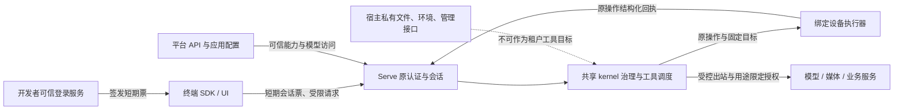

# RFC-USDK-1：运行端与终端执行契约

日期：2026-09-13。所属任务：USDK-00；合同会签任务：USDK-01。源码核对基线：`dd1da1af30774cad703f80c70a90325e6a093871`。

文档修订：v0.5（2026-09-24）。v0.2／v0.3为原PC初始化和宿主隔离设计，v0.4对齐身份、操作对账及共享事务；v0.5完成USDK-01资源、首批支持范围、语言分包和能力标识会签。修订号不是已发布wire／SDK版本。

**状态：已实施合同按§1、§13～15与同源 schema 对表；原提案中未实施的字段、平台发行格和验收余项仍明确保留。** 旧 `/v1`、`/v2` 与 L0 合同不改。文档内历史候选字段和错误名不能作为当前客户端接口；实现、验收、主线推送和发行分别记录。

关联：[开发方案](../report/USDK-开发方案-2026-09-13.md)、[开发计划与执行清单](../report/USDK-开发计划与执行清单-2026-09-13.md)、[现行会话合同](../98-Agent会话服务v2契约冻结件.md)、[同轮输入合同](RFC-INJ-1-同轮输入接纳与跨端回执.md)。

## 1. 目的与不变量

### 2026-09-20 实施切面

下列实际切面使用原SDK2 schema的具名定义，不创建另一套USDK wire文件；本文其余候选尚未实施者仍保持候选状态。旧SDK1及进程内SDK/Electron调用生态保留。serve/kernel继续拥有循环、上下文、权限和工具算法；终端只提供受控资源事实。

| 路径 | 方法／具名请求与响应 |
|---|---|
| `/v2/sessions/:id/initialize` | POST `SessionInitializeRequest` → `SessionExecutionCapabilities` |
| `/v2/sessions/:id/execution-capabilities` | GET → `SessionExecutionCapabilities` |
| `/v2/sessions/:id/execution-bindings` | POST `ExecutionBindingRequest` → `SessionExecutionCapabilities` |
| `/v2/executors/connections` | POST `ExecutorRegistrationRequest` → 201 `ExecutorConnection` |
| `/v2/executors/:id/heartbeats` | POST `ExecutorHeartbeatRequest` → `ExecutorConnection` |
| `/v2/executors/:id/operations` | GET → `ExecutionBatch`（有界领取，无SSE资源广播） |
| `/v2/executors/:id/receipts` | POST `ExecutionReceiptRequest` → `ExecutionStatus` |
| `/v2/sessions/:id/executions/:operationId` | GET → `ExecutionStatus` |

GET携 `protocol=sdk2-ext-v1`；领取另携connectionId。原消息/SSE/审批/输入/恢复仍走原v2。资源操作为inspect/read/write/mkdir/list/process.exec；加法整工具回调为tool.invoke；文件路径为工作区相对路径，核心使用 `/workspace/<workspaceId>` 虚拟路径。mtimeMs和exitCode使用十进制字符串，不放宽原控制编码数字规则。写入携expectedHash，执行器必须有实际条件写原语；不能用读hash后覆盖冒充CAS。process.exec默认不启用，不把原命令直接投向serve shell。

**执行边界：**远端 Shell 须同时具备应用 `execution.boundDevice.tools.shell` 授权、具名策略、设备 `process.exec` 后端及可信 `confirmInterpreter` 确认。解释器 `{id, revision, hostShell}` 进入注册、绑定、操作摘要和原权限引擎；缺失或失配返回 `executor_shell_unconfirmed`／拒绝派发。审批后再次复核，人工批准不能绕过。CLI、进程内 SDK 和 Electron 保持原行为。

English: Remote Shell requires explicit application and named policy grants, a controlled device process backend, and trusted confirmation of the actual interpreter. Interpreter identity, revision and dialect are bound to the operation and evaluated by the existing permission engine. Missing, changed or revoked confirmation prevents dispatch. Embedded CLI, SDK and Electron execution is unchanged.

操作digest = SHA256(UTF8(`tansr.sdk2.execution.v1\0`) || 原规范控制编码(operation去掉digest))，域分隔符为一个NUL字节。scope、session、绑定/连接/工作区代际、原始请求与期限全部进入摘要。服务端从原鉴权和可信装配取得身份与权限，不接受请求体授予角色。客户端核对受信scope、已核注册及绑定、摘要和请求/结果操作种类。

pending 的 receipt 必须 null；completed/failed 必须有匹配回执；unknown 可为 null（超时/恢复后无法确认）或持久 unknown 回执。unknown 不能作为重执行许可。副作用首次 claim 必须先持久化，同 ID/digest 的已完成结果可重发，pending 不再执行；complete 必须在向 serve 返回前持久化。首份终态不可变；已实施的可信 `reconcileObservation` 以原操作和未知回执摘要核对证据、追加后继已知事实，不覆盖首回执、不重做副作用，不采信终端任意自报成功。

应用能力由原平台bundle复核后与可信开发者策略及端能力取交集；控制者与执行器权限由原身份系统区分。显式执行档关闭宿主v1、cwd及旧工具回执入口；原未启用档行为保持。设备失联、租约失效或资源未注册均不能回落serve宿主。普通SSE仍负责交互与取消，资源参数仅由指定执行器领取。

serve 运行端统一承载共享 kernel 的循环、会话、上下文、记忆、权限与预算；终端 SDK 提供原生接入、交互、设备能力和执行事实。核心逻辑仍归 kernel，不能迁入 server 包后迫使 CLI、进程内 SDK、ACP、headless 依赖 HTTP 服务层。

serve 是 Linux、macOS、Windows 等 PC 客户端的统一远端基座；各平台差异收在终端适配机制、实际操作能力和代码／运行依赖中，不另造三套会话、记忆或权限内核。初始化报告客户端及执行器平台，应用配置决定业务能力上界；不能依据“桌面系统”自报默认开放全部工具。本机 serve 仍是同一基座的可选部署位置，Windows 首发里程碑不改变跨 PC 的公共合同。

本合同统一“在哪里执行”，不重建已有智能体。以下边界贯穿本地 serve、远端 serve、Windows／Linux／macOS 等 PC 端和移动端：

1. 模型、用户消息、Skill、工具输出均不能为设备授权，也不能自行指定可信执行主体。
2. 内核判定是否允许调用；执行器再次核验设备、工作区、实际目标和本机约束。两者取交集，后者不得扩大前者。
3. 工具算法与结果治理留在共享内核；资源操作可以由受绑定执行器完成。整工具回调与资源操作是两条通道，不能相互伪装。
4. UI 连接、运行中会话、执行器连接有独立生命周期。UI 离开不是默认取消；执行器离线不是切换执行地点的授权。
5. 连接恢复、历史恢复、审批恢复、崩溃后任务恢复分别声明。取消不承诺回滚，网络重试不承诺副作用恰好一次。
6. serve 仍是可嵌入会话引擎。凭证签发、登录、组织和计费由宿主及平台承担；本 RFC 不新增内置 OAuth 或完整集群平台。
7. 本合同防止未授权主体和陈旧连接驱动执行，不把被攻陷的设备管理员／执行器变成可信计算环境。设备上报的文件内容或执行结果不是远程证明。
8. 共享／公开 serve 的控制进程不向租户、模型或应用工具暴露宿主文件、shell、进程、环境及管理接口；应用开关、模型裁决和用户审批均不能打开该资源面。内核执行工具语义不等于 OS 副作用发生在 serve 控制进程。

## 2. 已有能力与本次扩展的分界

| 当前源码事实 | 本次工作 |
|---|---|
| `clientTools → buildRemoteTool → server.tool.request → tool-results` 已闭环，复用内核调度和权限 | 保留旧会话行为；为要求执行器绑定的新会话补定向路由及回执归属 |
| 旧桥按 `callId` 收第一份有效结果，并保留有界内存墓碑 | 不宣称其具有设备身份、跨进程持久去重或崩溃续跑保证 |
| `authenticate(req)` 只返回可信 `endUserId`，会话端点强制 owner 核验 | 新增宿主注入的应用域／角色／执行器授权扩展；不从请求 body 获取可信 app/user |
| 多 SSE 观察者合法，默认活跃会话和桥在本进程 | 新执行通道不复用可广播的会话 SSE 派工；单运行所有者和执行器租约另行维护 |
| 历史 store 可恢复已保存消息；同轮输入有独立 `turnId/historyEpoch` | 执行账本与历史 store 分工；不得把历史恢复当成原 QueryHandle 续跑 |
| `FsLike/SpawnLike` 是带 Buffer、stream、Node 错误和进程句柄的 L2 内部接口 | 定义跨语言资源合同；不直接序列化 Node 对象 |
| shell 在进入 SpawnLike 前已按宿主生成执行计划、环境及沙箱包装 | 目标 OS 的解析与执行计划移入目标适配职责；不向 Windows 转发 Linux 最终 spawn 参数 |

源码依据：[内部执行抽象](../../packages/kernel/src/world/types.ts)、[桥与工具代理](../../packages/server/src/v2/agent-bridges.ts)、[会话装配及同名保护](../../packages/server/src/v2/platform-session-factory.ts)、[现行认证和存储接口](../../packages/server/src/v2/types.ts)、[shell 执行器](../../packages/kernel/src/tools/shell/executor.ts)、[当前限值与帧定义](../../packages/server/src/v2/contract.ts)。

## 3. 两条执行通道与兼容策略

### 3.1 资源操作通道

内置 Read、Edit、Write、搜索、命令等工具继续由内核解释参数、进行调度、权限与输出预算治理。它们通过构造期注入的资源适配器访问目标设备；协议承载文件读取、条件写入、进程启动和输出等受约束操作。

一个工具调用 `toolCallId` 可以分解为多个 `operationId`。例如 Edit 先取得受约束读取结果，再进行带资源版本前置条件的写入。资源回执只能完成对应操作，**不能直接填充整个内置工具的 ToolResult**。最终 ToolResult 仍由内核构造和治理。

### 3.2 整工具回调通道

现有 `clientTools` 继续适合业务函数、文件选择器、摄像头等应用能力。申报 schema、effects、readOnly 和 handler 语义继续复用。旧普通会话保持当前 `/v2` 合同。

新会话若选择严格执行器绑定档，整工具回调须显式协商候选能力 `bound-client-tools/1`，通过定向通道交给指定 handler 归属者；原 `clientTools` 申报可由适配器复用，但不得同时向旧广播 `server.tool.request` 派发同一个调用。该能力与候选 `resource-execution/1` 分别协商，不能互相冒充。

严格绑定档未具备 `bound-client-tools/1` 时，携带需要终端执行的旧 `clientTools` 必须明确拒绝或由开发者在创建前移除；不得悄悄退回会话 owner 抢答。普通 legacy 会话不因安装新服务就被改变行为。

2026-09-20已实施切面：ExecutorRegistrationRequest新增可选tools数组（name/definitionDigest）与tool.invoke操作。请求argsJson、结果resultJson使用旧业务JSON（允许Unicode参数名及小数），各有32KiB UTF-8和32层限制；外层控制字节仍按原规范。definitionDigest = SHA256(UTF8(`tansr.sdk2.client-tool.v1\0`) || 原kernel canonicalStringify(ClientToolDeclSchema.parse(decl)))；不补可选字段默认值。serve/extensions导出clientToolDefinitionDigest；终端使用开发者已验证声明的摘要，不能盲信请求中的摘要为handler授权。旧init.tools保持只辖装配集，新initialize.requestedTools收窄全部有效工具。上述实现由八个执行端点承载，不新增广播派工。

Skills沿原注册表，device正文只读绑定虚拟工作区，managed-service只读可信内联正文。MCP沿原McpHost/forToolset与连接治理；共享serve只接受精确白名单内的受控HTTP，禁止宿主stdio与私网/重定向。动态工具仅从该MCP会话专属注册表采纳对象身份。端侧stdio适配仍在待办，不据此声称全部MCP传输已打通。

### 3.3 必须堵住的交叉旁路

- 新资源操作和绑定回调的 ID 不登记进旧桥 pending 表；旧 `POST .../tool-results/:callId` 永远不能完成它们。
- 在新严格绑定档，旧结果和权限应答入口即使通过会话 owner 校验，也不能答复新账本中的执行／审批票。
- 绑定回调结果只接受为该次调用注册的自定义工具；内置工具名称冲突规则继续保留。
- 新账本查询缺失、执行器离线、能力不足或超时，均不得转为“上传整个内置工具结果”、同名 clientTool、服务端本地工具或另一设备重试。
- 历史 attach 不重新装配执行器或 clientTools；变更执行地点须明确动作、空闲期和重新授权。同轮追加输入也不能暗改执行目标。

## 4. 版本协商与候选入口

优先在现有 `/v2` 旁增加显式扩展，旧帧和旧返回体保持；不为第一版强制迁往 `/v3`。若会签发现必需的语义无法以独立扩展兼容，再提出新前缀，不能在实现时直接破坏 v2。新增 L0 类型必须独立走 protocol 会签和版本流程。

候选入口如下，仅用于明确责任边界，USDK-01 锁定最终名字：

| 候选入口 | 责任 |
|---|---|
| `GET /v2/sessions/:id/execution-capabilities` | 返回该会话真正可用的扩展、版本、目标档及限值；仍先认证和校验 owner |
| `POST /v2/sessions/:id/execution-bindings` | 空闲期将宿主已授权的执行器／工作区绑定到会话；不接受客户端自授角色 |
| `POST /v2/executors/connections` | 已获宿主注册授权的执行器主动建立连接，协商能力并领取连接身份 |
| `GET /v2/executors/:executorId/events` | 受执行器身份限制的定向派工 SSE；不是会话事件观察者入口 |
| `POST /v2/executors/:executorId/heartbeats` | 续租、交换确认水位与压力信息 |
| `POST /v2/executors/:executorId/receipts` | 上报操作或绑定回调的状态／终局回执，校验完整归属 |
| `GET /v2/sessions/:id/executions/:operationId` | 授权主体查询执行事实；输出不包含设备凭证 |

第一版可以继续使用 SSE 下行加 POST 上行，终端主动出站，不要求用户设备暴露入站端口。WebSocket、管道或其他传输以后替换时复用同一应用状态机；它们不替代身份与租约。

新客户端建议先创建无 prompt 的空闲会话，再绑定执行档、最后起轮。绑定切换与起轮必须在同一会话排他边界下检查并提交，可携预期配置版本；仅在请求开始时看见 idle 不足以避免竞态。已起轮则拒绝切换，不能让一轮前半段在服务端、后半段在设备执行。

协商响应候选字段为 `extensionVersion`、`supportedCapabilities`、`requiredCapabilities`、`durability`、`limits`、`executionProfile`。能力示例：`resource-execution/1`、`bound-client-tools/1`、`receipt-query/1`、`receipt-durable/1`、`run-resume/1`。每个能力必须由真实实现和适配器决定；配置历史 store 不能自动打开最后两项。

客户端必须先探测、再请求所需能力，服务端再次确认；返回 404／明确 unsupported 只表示未提供扩展。发现能力不满足，应报可解释错误；不能 cancel＋重发、降级授权或转移执行位置模拟成功。

旧合同的未知键／未知帧容忍规则继续适用。新操作体按已协商版本及明确操作联合类型校验：未知必需能力或未知操作类型直接拒绝；不能靠“忽略字段”略过工作区、条件写入或身份约束。新增无安全语义的观测键才允许忽略。

### 4.1 三类平台身份与统一初始化

| 信息面 | 来源／作用域 | 禁止的推导 |
|---|---|---|
| `serveHost` | serve 进程实际 OS／架构／运行时，标识服务端执行后端 | 不能用它解释终端文件路径或命令 |
| `clientPlatform` | 每个 UI／控制客户端初始化报告的 OS／架构／SDK 运行时 | 不能据浏览器或手机接入把会话执行平台改成该客户端平台 |
| `executorPlatform` | 已认证执行器适配器依据本机运行环境报告的实际 OS／架构／运行时 | 不能由 UI 声称“我是 Windows”代替，也不因报告字段而证明执行器未被攻陷 |

平台信息按连接／执行器保存，不设置会被“最后接入客户端”覆盖的共享 serve 全局 platform。同会话可被 Windows、macOS、Linux、Android、iOS 同时观察；已经绑定的执行器、工作区及其语义版本保持，观察者增加或离开不改变执行地点。模型是否在云端、serve 所在 OS 和文件实际所在设备也分别记录，不由一个 platform 字段承载。

新初始化请求候选结构如下，可由客户端初始化扩展与执行器连接扩展分别提交，不能让 UI 冒充执行器提交认证产物：

```jsonc
{
  "extensionVersion": 1,
  "clientPlatform": {
    "platform": "windows",
    "arch": "x64",
    "runtime": { "name": "dotnet", "version": "<actual-runtime-version>" },
    "adapter": { "id": "<client-adapter-id>", "version": "<adapter-version>" }
  },
  "requestedCapabilities": ["session.observe", "fs.readRange"],
  "executorManifest": {
    "manifestVersion": 1,
    "executorPlatform": {
      "platform": "windows",
      "arch": "x64",
      "runtime": { "name": "<actual-runtime>", "version": "<actual-version>" },
      "adapter": { "id": "<executor-adapter-id>", "version": "<adapter-version>" }
    },
    "operations": [
      { "name": "fs.readRange", "semanticVersion": 1, "constraints": { "maxBytes": 4096, "workspaceRequired": true } }
    ]
  }
}
```

仅为 UI 的客户端不必附 executorManifest；执行器注册／连接时必须独立报告自己的操作清单及版本／约束。manifest 应反映实际安装的适配模块和依赖能力，不能仅按 OS 名称生成全量承诺。服务端按已支持合同、认证绑定和适配验证接纳；runtime／adapter 版本用于兼容及定位，不构成授权。

平台缺失或未知时，可按兼容档保留纯会话、历史、事件或已授权远端能力；对应设备资源能力保持 unknown／unsupported，不猜成桌面全工具。未知 UI 平台不应撤销另一个已正确绑定执行器的能力。具体纯会话可用范围仍受当前应用授权，而非默认绕过应用配置。

本节新增字段属于候选扩展，不改写现有应用拓扑／`platform.*` 能力键，也不要求旧 v2 客户端补字段才能维持原合同。

### 4.2 应用能力上界与按执行位置求交集

`applicationScopeId` 仍由认证／可信装配得到；客户端传来的 appId 或初始化 platform 不能选择别人的能力档。应用策略是业务能力上界，SDK 的 requestedCapabilities 只表示请求或进一步缩减，不具备越过应用开关、角色或本机限制的作用。manifest 的“支持”也不能自动成为“已开启”。

requestedCapabilities 缺省表示没有附加缩减要求，不表示自行获授全部能力；空集表示主动不请求工具执行，具体语义须与现行 tools 白名单的空／缺省语义对表。

每个能力按明确执行位置计算有效集合，而不是把所有终端限制笼统求交集：

`effective(capability, location) = 应用策略 ∩ 宿主策略 ∩ 该位置真实适配能力 ∩ 协商版本 ∩ 角色授权 ∩ 该位置本机授权 ∩ 当前运行限制 ∩ SDK主动缩减`

不适用于该执行位置的条件标为 not_applicable，而非当作 false。例如终端没有麦克风，只影响该终端录音／采集，不应关闭 serve 经受控服务接口提供的 TTS、图片／视频生成、模型调用；远端文件能力也不能因 UI 客户端没有本地文件权限就自动转成本机执行。共享 serve 不提供宿主资源执行位置；其加载了文件工具语义，也不意味着该工具可访问宿主盘或任意用户 PC 工作区。执行种类必须符合 §4.7 的封闭集合。

同一业务能力可有多个支持位置，但本次调用必须选择已绑定、获授权的具体位置；对同一 operation 不进行位置自动回落。SDK 可请求某个受支持目标，最终由可信策略和绑定决定。

| 维度 | 回答的问题 | 不等价于 |
|---|---|---|
| OS／运行时信息 | 这一连接或执行器属于什么平台 | 能够执行哪些操作 |
| 支持能力与语义版本 | 实际适配器实现了什么 | 应用已经开放 |
| 配置开放 | 应用／宿主允许提供什么 | 当前主体具有角色权限 |
| 角色授权 | 当前主体能观察、控制、审批还是执行 | 本次参数已经批准 |
| 当前运行可用 | 当前绑定、依赖、租约和限制能否接纳调用 | 永久可用或已批准副作用 |

### 4.3 有版本的有效能力作为共同事实

服务端初始化／绑定响应返回候选 `effectiveCapabilities` 投影及 `capabilityRevision`，同时提供 applicationPolicyVersion、hostPolicyVersion、manifestVersion／digest、bindingRevision、协商版本、生成时刻和有效期限。应用主体和其他敏感策略只输出调用者可见的最小信息，不泄露 appkey、完整权限规则或秘密引用。

每个能力条目候选字段为 `name`、`semanticVersion`、`executionKind`、`resourceTarget`、`supported`、`configured`、`roleAllowed`、`available`、`requiresApproval`、`constraints`、`unavailableReasons`。`executionKind/resourceTarget` 用于明确实际执行位置，不用含糊的 server／serveHost 值把宿主系统资源与受控远端服务混为一类，具体边界见 §4.7。不可用原因使用稳定机器码，例如 unsupported_platform、adapter_missing、policy_disabled、role_denied、binding_missing、executor_offline、policy_stale；用户文案走 i18n。未确定的支持／可用性返回明确 unknown，不以空列表或 false 隐藏原因。

`available=true` 只表示当前有资格参与调用，仍必须对本次参数走内核权限和本机检查。需要 ask 的能力可以向模型注册，并标记 requiresApproval；不能把还没获得本次人工批准错误地解释为完全不支持。

模型工具注册、调度的 dispatch 检查、客户端 UI 和 demo 必须消费同一服务端有效能力事实及版本。只在 UI 隐藏按钮不算关闭能力；模型未展示的旧工具调用或伪造客户端请求仍必须在调度层被拒绝。有效集合变化后，新的模型请求按当前允许集合装配；已进入上下文的旧工具描述不产生执行权。

capabilityRevision 是视图和策略求值水位，不是 operationId 或替代 grant。观察端只订阅／拉取脱敏投影，不据本机 OS 再维护一套开放工具逻辑。运行中变更可以即时收窄 dispatch；放宽涉及新工具集合或目标语义时，在受控安全点／下一轮重新装配，不能修改正在执行的操作。

会话执行能力按该运行的已授权主体及绑定执行器求值；某个新观察者只有 observe 权限，不应据此把整个会话的工具改成不可执行。观察者自己的控制／审批权限可通过独立 viewerPermissions 投影展示，并与执行有效能力区分，不能用最后连接者的角色覆盖运行授权。

### 4.4 动态撤权、策略失联与已存在操作

应用策略收窄须区分平台API的权威版本提交点、各serve接收并验证新版本的本地生效点，以及两者之间的传播窗口。外部API提交与远端serve派工不天然处于同一事务，不能承诺保存配置的一刻所有实例同步停发。每个serve在本地生效点更新capabilityRevision，并与派工检查形成一致的排他边界：**从本地生效点起禁止不再获准的新dispatch**；即使没有收到通知，旧策略有效期届满也禁止依赖它的新执行。平台提交至本地生效的最大传播/缓存有效期及通知失败处理由USDK-01冻结并如实对外说明。

宿主/角色/依赖收紧按其可信来源的版本及相应本地生效点处理；本机权限撤销由执行器本地检查立即收窄。新限制生效后，使已派发但尚未执行的受影响票失效并通知执行器，执行器每次开始前重新检查本地有效约束；不能因为此前批准过就继续启动。需要比有限传播窗口更强的策略档，须采用权威实时启动授权等明确机制，并验证其授权到副作用之间的竞态边界，不能借“实时”一词声称跨分区原子撤权。

已经开始或已发生效果的操作不伪装成“撤销成功”：尽力取消、保持原账本与回执接纳、按实际状态对账。断开的执行器无法被瞬时远程撤权，本机依靠有限策略有效期／租约停止新启动；若产品档要求撤权后绝不再启动，就必须采用可验证的实时启动授权或在失联时禁止启动，不声称分区期间具备瞬时全局撤权。

放宽应用策略、提升角色或恢复硬件不会扩大旧 grant；旧操作仍受批准时约束与最新限制的交集。目标设备、工作区、操作语义版本或适配器语义发生变化时，空闲期重新协商绑定，不能热换底层实现后用旧批准继续执行；只读观察客户端平台变化不触发这一执行绑定变更。

应用策略使用有版本、有限有效期的可信快照。刷新机制可采用后台提前续取和变更通知，dispatch 检查当前快照水位，不要求每轮无条件同步远程拉取。USDK-01 必须冻结各档的 maxAge／validUntil、失联行为和撤权传播上界；严格执行档不得把任意旧缓存永久当授权。

策略已过期或版本被撤销且无法刷新时，冻结依赖它的新设备资源／业务工具派工，返回 policy_stale；不会因此删除会话、拒收原回执或中断纯观察／历史读取。模型会话只有在其独立认证和相应应用授权仍有效时才可继续，不能以“纯对话”绕过已失效的模型／计费授权。首次初始化没有可信策略时也不默认开放。这样将策略失联的影响限制在实际依赖范围，而不是使整个远端会话基础因一次刷新失败不可用。

平台信息、capabilityRevision 或应用策略版本更新不改写旧操作的不可变 requestDigest。原票继续查原账本，并在执行前受新的限制；需要更换目标／参数／适配语义时不能重算同一 ID 的摘要，而应先确认原操作未执行或完成对账，再形成新的明确决策。撤权后的合法晚到回执仍用于记录原效果，不能被新策略拒绝后丢失副作用事实，也不能借回执触发后续未授权执行。

### 4.5 v0.2 补充会签与对抗输入

USDK-01 应以同一 serve 同时接入 Linux／macOS／Windows UI，并绑定另一平台执行器验证：最后登录平台不能覆盖其他会话或执行器；未知 UI 平台可保持允许的纯会话；伪造 manifest 不增加权限；应用禁用真实阻止模型调用／dispatch；无麦克风不误关远端 TTS；策略过期不无限沿旧缓存派工；撤权与启动竞态、断网撤权、适配器升级和旧票重放均按本节处置。各 OS 的实际资源实现分别验收，不因统一初始化就声称全部平台适配器已经交付。

本补充不改变 G2／G3 边界：协商表／有效能力快照并不等于耐久运行恢复，G3 仍按 §10 要求完成两实例真实接管。

### 4.6 既有应用平台、能力装配与统一解析器的迁移边界

当前 API 的 `platform` 是 `desktop / mobile / server` 应用业务类型（本 RFC 称旧 applicationPlatform），并不是 Windows／macOS／Linux OS。当前映射为 desktop／server → embedded、mobile → hosted；hosted 档固定关闭文件、命令等工具，只允许 TodoWrite、AskUser、customTools、WebSearch 及可配置媒体能力。事实源：[API 应用合同](J:/tansr/tansr-api/src/contract/app-sdk.ts:219)。

新 `clientPlatform`、`executorPlatform` 和候选 `runtimeTopology` 必须独立于旧 applicationPlatform。初始化报告 windows 或 desktop，均不能把既有 hosted 会话切成 embedded、打开服务端文件工具或放宽 mobile 默认。新客户端提供设备文件能力也不意味着 serve 获准读取自己的磁盘。

按执行位置的授权及“受绑定终端执行档”必须由可信应用配置显式选择，采用有版本的新合同；旧 platform／boolean 的读写语义和存量默认保持。不能把旧 false 当作“未指定”自动放开，也不能在兼容层把 mobile 全部迁成拥有终端 shell 的新档。USDK-01 须锁定显式迁移字段、应用 opt-in、按位置的授权表达及退出／回退规则；未 opt-in 的应用继续按原档运行。

平台 token 模式继续从应用 bundle 获取能力，保留对 SDK `capabilities` override 的拒绝，客户端请求缩减通过本 RFC 的显式请求面表达，不能借初始化绕过原验证。非平台 Node 注入模式仍可使用原宿主合同，不强制创建平台 app 或改成平台 token 模式；宿主为新严格执行档提供自己的可信应用域和策略来源即可。源码：[平台入口约束](../../packages/sdk/src/platform/client.ts:375)。

当前 serve 的平台装配仅实现 TodoWrite／AskUser、WebSearch 和媒体等既定内置集合，能力为 true 也不能据此推断所有 kernel 工具已经接线。平台提供方材料缺席时，相应工具不会装配；当前 `init.tools` 只收窄 builtin，随后 clientTools 独立叠加且保持同名保护。[装配事实](../../packages/server/src/v2/platform-session-factory.ts:222)、[现行白名单边界](../../packages/server/src/v2/platform-session-factory.ts:332)。

因此 §4.3 的统一 effective-capability resolver 是本轮新增实现任务，不是现有 bundle 字段的重命名。严格档在判定支持／可用时，必须确认目标适配器、操作版本、资源／媒体提供方材料、业务 handler 或 MCP 连接／发现／授权入口实际齐备；只有开关、schema 或 manifest 自报不够。新严格 resolver 对 builtin、绑定 clientTools、MCP 及后续扩展采用共同授权和派工约束，缺入口返回具体 unavailable 原因，不能注册一个实际无法执行的工具。

上述统一治理仅在明确协商的新严格档生效。legacy `init.tools` 不能被静默改成“约束所有 clientTools／MCP 的全工具白名单”；若新档需要统一 allowlist，使用独立有版本语义并完成兼容验收，不借修复之名改变旧应用。

bundle 缓存失效／ETag 更新不等于活跃会话能力已经重新计算、旧授权已经撤销。当前 [system-prompt-refresh](../../packages/sdk/src/platform/system-prompt-refresh.ts) 刷新的是平台提示词及其组合策略，不能据其存在宣称已有工具能力动态刷新。§4.4 所需的能力快照版本、变更通知、调度屏障、模型工具集合更新和终端撤权接线必须单独实现并验收，同时保持已有提示词刷新合同不退化。

### 4.7 共享 serve 宿主隔离与执行种类（v0.3）

共享 serve 控制进程负责协议、状态、授权、调度和内核工具语义；租户／模型不能获得它所在机器的任意文件、shell、process、env、包管理、服务管理或运维 socket 能力。宿主系统资源不登记为租户可选目标，不因应用管理员打开 shell 或用户批准调用而解锁。`serveHost` 仅作运行环境信息，不是资源定位符。

租户执行面候选 `executionKind` 为以下三种，注册和有效目标均由可信宿主装配决定，请求不能新增第四种：

| executionKind | 可提供的能力 | 目标与边界 |
|---|---|---|
| `bound-device` | 已绑定 PC／移动端的资源操作或业务 handler | 固定 executorId、workspaceId／revision 和目标适配语义；执行器为独立受授权终端，不能把 serve 宿主适配器伪装成设备目标 |
| `managed-service` | 模型、媒体、搜索及明确业务 connector 的窄接口 | 固定 service／connector 登记 ID、受限操作和材料；不是任意 URL／路径／凭据透传，不提供宿主文件或命令 |
| `isolated-worker` | 在经验证隔离环境执行租户可编程工作 | 固定 worker／isolationId、运行归属、资源和出站档；必须具有独立隔离证据，不能指向 serve 控制进程或系统卷 |

`host-control` 仅是本文对部署运维面的描述，**不属于租户 wire 枚举、不进模型 catalog、不进有效能力列表**。运维动作走独立身份和管理入口，不能通过 session、ToolResult、MCP 或 Skill 触发；租户发送该种类或宿主目标一律拒绝。

isolated-worker 默认关闭。提供它须单独明确启用、确定隔离技术与维护责任并实际验收，不因 G1／G2 的设备管道完成就算 worker 交付；本批 G1／G2 不自动包含这一后端。严格档缺少相应设备／隔离后端时能力 unavailable，禁止回落控制进程裸跑、默认 FsLike／SpawnLike 或临时“安全目录”。

资源派工必须固化 executionKind 与目标 ID：设备使用稳定 executor／workspace 绑定，worker 使用稳定 isolationId／运行归属；这些进入原操作语义摘要。普通传输重连可换连接封套，不能将原票改成宿主目标、另一隔离环境或不同 executionKind。复用工作区名或相同文件路径不能证明目标相同。

**租户提供的代码与部署代码分开。** 控制进程只加载部署时由可信维护者装配、固定版本的实现；禁止租户通过会话配置、应用字段、MCP 申报、Skill 附件、hook、插件／npm 地址或任意 import 在控制进程运行代码。任意租户 MCP stdio、Skill 脚本和 hook 的执行只能走已授权设备或另行启用的 isolated-worker。远端 MCP 也须经过受控连接和工具注册，不能因地址是 HTTP 就跳过出站、身份和能力限制。业务 handler 可复用现有合同，但严格共享档 handler 来源必须是受信部署装配或已绑定端侧，不能执行租户提交的 JavaScript。

受信来源也不是宿主资源暴露豁免：不得将 `readFile(modelPath)`、`exec(modelCommand)`、任意 env 查询或管理 socket 请求包装为“业务函数”向模型开放。代码装配来源与函数能访问的资源边界须分别审查；审批不能使这类包装器合法进入共享租户工具目录。

**材料和管理面不继承。** 设备／worker 不继承 serve 的 process.env、平台主密钥、RDS 凭据、宿主系统卷、Docker／容器管理 socket、宿主进程管理接口或数据库直连。材料通过按应用／用户／运行限定的窄接口交付；必要业务密钥使用作用域受限的受保护引用，而非整组宿主凭据。隔离配置、mount、特权位、网络档和管理入口仅能由可信部署配置控制，初始化请求、应用开关和模型参数无权修改。

会话存储、记忆、artifact 和历史由 serve 通过具应用／用户／工作区域的 API 访问，租户只使用逻辑 ID，不得到任意服务端 path／SQL／存储连接。内部存储当然可以由受信实现落盘，但该 I/O 不能注册成模型文件工具；checkpoint 导入、导出和附件解析也必须维持这一边界。

**受控服务和出站。** managed-service 保留合法模型与媒体链；每个 connector 由受信登记提供目标、允许动作、参数 schema、凭据注入与响应投影。模型可填写业务参数，不可替换基址、任意请求头、凭据引用或输出落盘路径。通用网页抓取与业务 connector 是不同能力：前者缺受控出站实现时 unavailable，不为保留媒体而放开任意 fetch，也不因限制通用 fetch 而关闭已登记媒体提供方。

G0 必须冻结并验证 URL 解析、DNS 解析后实际连接目标、每一跳重定向、代理与 IPv4／IPv6 规则；覆盖 loopback、私网、链路本地、云元数据地址、编码／混合表示、DNS 重绑定及重定向进入禁止网段。策略检查必须约束最终连接和后续跳转，不能只检查原始 URL 字符串；需将应用层解析与实际受控出站通道联动。默认禁止到宿主管理／元数据目标；业务确需访问授权内网服务时使用运维登记的专用 connector 和限定目标，不能由租户临时加入允许名单。

这些均为待 G0 实证的机制要求，不是“绝无漏洞”的证明。审批、裁决人、进程分离、Docker 名称、目录前缀都不能替代隔离；若选用容器／OS 隔离，须用实际身份、mount、网络、管理面和逃逸负例说明获得的边界，不能只展示创建进程或容器成功。

**兼容与旧入口。** 既有单用户 CLI、非共享进程内 SDK 的本地合同保持，不借严格共享档削掉原本地能力。共享／公开 strict 部署的租户监听入口则必须统一执行宿主硬禁：旧路由、body.cwd、profile、init.tools、clientTools、checkpoint、MCP 和 Skill 入口都不能导入宿主目标、加载租户代码或触及控制面。旧客户端可使用允许的基础会话／媒体兼容档，但不得因未协商新扩展而被回落到宽权限 legacy 装配。隔离策略由部署确定，不能让请求选择“关闭严格档”。

USDK-01 会签及对抗验收须加入：应用开全仍无宿主 catalog、伪造 host-control／目标、旧接口绕行、MCP／hook／npm 注入、环境／mount／socket／数据库逃逸、存储路径穿越、最终地址／重定向 SSRF、设备离线后 host 回落和 worker 不可用回落。合法媒体与业务 connector 仍需正例通过；仅全面关闭网络不算完成受控服务能力。

## 5. 主体、身份与授权绑定

### 5.1 身份来源

| 候选标识 | 可信来源与用途 |
|---|---|
| `applicationScopeId` | 宿主认证／固定装配产物；为已有 appId 建隔离域，不接受 body、query 或标签自报 |
| `endUserId` | 原认证结果；与应用域组合成 owner，不能跨 app 合并同名用户 |
| `sessionId` | serve 铸造的会话 ID；仍不是授权因子 |
| `historyEpoch / turnId` | 复用同轮输入的运行目标语义；客户端不能用旧轮 ID 定向新轮 |
| `runId` | 运行端生成并持久保存的稳定逻辑运行 ID；进程重启或接管不改变，禁止拿现有 `labels.runId` 当身份或锁键 |
| `runAttemptId / ownerEpoch` | 本次运行恢复尝试与所有者 fencing；接管时变化，不改变原 runId 或 operationId |
| `toolCallId / operationId` | 运行端生成并记账；前者绑定内核调用，后者区分资源操作 |
| `executorId` | 宿主登记并授权的安装／执行主体；设备显示名不构成认证 |
| `executorIncarnation` | 执行器本次进程实例；重启变化，不覆盖稳定安装身份 |
| `connectionId` | 本次认证连接；重连重新生成，不从 SSE 游标推导 |
| `leaseEpoch` | 授权端持久维护的单调代际／不重复 fencing 值；旧连接不能续新租约 |
| `workspaceId / workspaceRevision` | 执行器本地批准的工作区绑定；其 OS 路径映射不等于任意客户端路径 |
| `grantId / grantDigest` | 对主体、目标、操作和期限的批准记录；不是可见正文即可使用的 bearer |

所有身份比较使用结构化 tuple，不用无转义字符串拼接产生串域碰撞。应用／用户／会话／运行／调用／执行器／工作区必须在受理点联合核验；“ID 很随机”不替代归属校验。组织归属和额度由平台／宿主裁定，不能由终端的 `organizationId` 直接切账。

应用域隔离是宿主存储／授权键的组合，不得拼接改写后传给平台的 `endUserId`；平台铸令牌、用量查询与结算继续使用已确认的原始 endUserId 和独立 app 身份。G3 接管沿用持久 runId 和原操作 ID；新进程只生成 runAttemptId／ownerEpoch，不能通过新 runId 把同一副作用变成“新动作”。

资源派工信封候选如下。例子仅表达字段归属，不是可直接调用的稳定 API；服务端必须逐项与自己的账本、认证连接核对，不能因 body 中出现这些字段就信任它们：

```jsonc
{
  "extensionVersion": 1,
  "kind": "resource.operation",
  "scope": { "applicationScopeId": "app-domain", "endUserId": "user" },
  "target": { "sessionId": "sid", "historyEpoch": "epoch", "turnId": "turn", "runId": "run" },
  "toolCallId": "tool-call",
  "operationId": "operation",
  "executionKind": "bound-device",
  "executorId": "device",
  "delivery": { "runAttemptId": "attempt", "ownerEpoch": "owner-fence", "executorIncarnation": "boot", "connectionId": "conn", "leaseEpoch": "executor-fence" },
  "workspace": { "workspaceId": "workspace", "workspaceRevision": "revision" },
  "operation": { "type": "fs.readRange", "path": "notes.txt", "offset": 0, "maxBytes": 4096 },
  "authorization": { "grantId": "grant-reference", "grantDigest": "opaque-digest" },
  "requestDigest": "immutable-operation-semantics-digest",
  "remainingTtlMs": 10000
}
```

终局回执携原 scope／target／operationId／executor 绑定、`requestDigest`、单调 `receiptRevision`、`state`、`effectState`、受控 `result` 或 `error`，并报告输出完整性。摘要算法、规范化字节、浮点／Unicode 处理和 ID 类型须会签逐语言金样；上例不擅自规定现有 epoch／turn 的实际序列化类型。`grantDigest` 不是签名也不是授权，授权来自受验证连接和服务端匹配的有效 grant 记录。

`requestDigest` 只摘要不可变操作语义：协议／操作版本、app/user/session、原逻辑 run/turn/history 目标、toolCallId、operationId、executionKind、稳定资源目标（设备 executorId／workspaceId/revision，或另行启用 worker 的 isolationId／归属）、参数与批准时固定的安全约束。`delivery`、当前认证连接、executorIncarnation、runAttemptId、ownerEpoch、leaseEpoch、剩余 TTL 和重投次数属于可变传输封套，**不得计入该摘要**；否则正常重连会成为同 ID 异体冲突。

封套不进语义摘要不代表可以伪造：每次传输仍逐项认证并校验当前租约和原 grant。新连接只能承接原操作的权限交集，不能换设备／工作区／参数或放宽安全约束；旧 grant 的期限不得借重连、减小 remainingTtl 后重投或新连接身份延长。安全约束有变化必须新批准，不能通过改封套绕过同 ID 异体检测。

### 5.2 宿主鉴权扩展

保留原 `authenticate(req) → {endUserId}|null`。新严格档增加候选宿主钩子 `resolveExecutionPrincipal`／`authorizeExecutionBinding`，提供已验证的应用域和 `observe / control / approve / execute` 权限。具体接口在 USDK-01 会签，不能把这些字符串直接加到旧响应并默认全允许。

旧单 app 工厂可由可信装配映射固定应用域。多 app 宿主必须对 registry、历史、记忆、运行账本、执行器和事件查询使用同一域；不能只把列表过滤成多租户，而底层账本仍以裸 endUserId 寻址。

执行器使用宿主提供的注册／短期认证方式，只获绑定所需 scope，不取得 appkey、模型上游密钥或整套用户会话 cookie。协议不规定另造 JWT／OAuth。远端传输要求 TLS；本机模式使用受保护的本地端点和客户端身份，不能因 loopback 就允许任意浏览器发命令。若采用命名管道，须验证 ACL 和对端身份；若采用本机 HTTP，仍须鉴权和限制跨站访问。

### 5.3 观察者、审批者和执行者分离

会话 SSE 可展示工具进度及脱敏摘要，不能广播执行凭证、完整待执行环境或可代答的票。只有被绑定的执行器连接能收到派工并提交执行事实。

观察者即使与控制者为同一 endUserId，也不自动获得 execute／approve 权限。人工批准须绑定完整调用摘要、参数 digest、应用／用户／会话／运行、目标工作区版本和期限。参数或目标改变必须重拍；旧 session 级许可不能跨 app、设备或新工作区复用。内核审批仍是主裁定，终端本机确认只增加限制，不复制一套模型裁决人。

## 6. 执行器主动连接、租约与代际

第一版采用单运行所有者，执行器主动出站。执行器注册与会话绑定独立：登录成功不意味着可操控该用户名下任意设备。绑定请求由控制者发起，经宿主授权和设备本地接纳后生效。

一次操作固定绑定 `(applicationScopeId, endUserId, sessionId, runId, executorId, workspaceRevision)`；租约续期可以更新连接，不改变操作的执行地点。候选流程：

1. 执行器建立认证连接，报告实际 OS、进程实例、能力、可授权工作区和资源帽。
2. 服务端协商能力，授予新的 connectionId／leaseEpoch；撤销旧连接的新增派工资格。
3. 执行器拉取只属于本绑定的操作；核验身份、期限、本地授权和操作 digest，持久接纳后应答。
4. 心跳只续当前代际；重连先交换未结束账本和已确认水位，再决定可接纳的新任务。
5. 服务端／设备撤销或租约过期后停止接纳新操作；在途操作尝试取消并上报实际状态。

**租约失效不证明原设备的操作已经停止。** 网络分区时旧设备可能已启动外部进程；即使新的连接代际成立，也禁止把同一副作用操作派往另一台设备或另起一次。须先取得完成回执、证明未执行，或保持结果未知供对账。

旧连接递交的新结果不得直接更新新代际运行；当前已认证执行器可以在重连对账时提交原代际的持久终局证据，但只能关联原操作，不能解锁或完成新轮调用。证据不全转入待对账，不靠 last-write-wins 覆盖。

期限以服务端租约和执行器本地单调计时共同约束。重传不能把原始 TTL 重新算作完整寿命；续租也不能延长已有操作的绝对截止。时钟漂移、长时间休眠后先重新握手和对账，未完成之前禁止开启新副作用。具体时间预算与本机时钟行为由 USDK-01／05 验证冻结。

租约状态不能只存内存后在重启时从零复用。数据库备份恢复等导致 fencing 历史回退时，必须变更授权纪元并使旧连接失效，重新握手后才派工；不能让旧租约因时间回退重新有效。

**Serve 会话所有权租约（文件实现；SRV-OWNER-01 2026-10-02）**沿同一原则：独占由代际围栏保证，不由时间保证。owner 的每次持久写都在原 journal 锁内先读 meta、比对 `(ownerId, claimId, attempt, host, released)` 再写；接管者的 claim 同样在锁内写入新 `claimId`/`attempt`，故旧 owner 的下一次持锁操作必然失配而 fail-closed（`owner_stale`）。`expiresAt` **只是他人的接管资格**（故障检测器）：`claimOwner` 仅在 `prior.expiresAt <= now` 且未释放时允许接管；owner 自身的操作（`assertCurrent`/`fence`/`write`/`beginTurn`/`checkpoint`/`renew`/Store 写）**不比对 `expiresAt`**，过期但尚未被接管的 owner 不会把自己判死，可继续续约（自愈）。续约触发：owner 的每一次持锁 meta 写（`beginTurn`/`checkpoint`/commit 及其它 Store meta 写）都顺带把 `expiresAt` 前推一整个租约（活动即续约）；心跳 `renew()` 是兜底续约，排在同会话持久队列之后，一拍未落地前不排第二拍。注意事件泵的逐帧 `fence(publish)` 只取锁核验代际、**不写 meta、不前推 `expiresAt`**，故纯流式一轮（无工具、无 meta 写）里唯一的续约来源仍是排队中的 renew；接管窗口 = 「上一次续约落地 → 下一次落地」的间隔，而非一次写——病态慢盘上活 owner 可在轮中处于可被接管状态数秒，此时另一 Serve 带 `runtimeRecovery` 对同会话 resume 可合法接管并 fence 掉活 owner（活性损失：旧 owner 下一次持锁操作 `owner_stale`、在飞模型调用重复；非安全损失：文件锁 + 代际围栏杜绝双写）。该窗口在本卡前即存在，本卡只增加续约来源、未放宽接管资格。`leaseMs` 下限 **5000 ms**（此前 1000）：它只需覆盖「心跳一拍 + 一次持锁持久写的排队与落盘」，受压宿主单次 fsync 尾延迟实测 250–800 ms、一次 commit 3–5 次 fsync，5000 ≈ 10 × fsync 尾延迟是实测不误接管的最小量级；按介质探测动态校验会让 API 接受与否取决于瞬时 IO，不可复核，故取固定下限。缺省 30000 不变。共享事务 Store（`createTransactionalServeAgentSessionStore`）的 owner 操作仍按 DB 时间自判过期（`current()` 的 `expiresAt <= tx.now`、`assertCurrent` 的 `now() >= expiresAt`；其 `backend.publishEvent` 合同同判），且只有 `renew()` 一种续约来源；本次只同步下限，两实现尚无以 `ServeSessionOwner` 合同为中心的共同参数化合同测试，语义对齐与合同测试为待决项。

## 7. 操作状态、持久回执与不确定窗口

### 7.1 状态合同

候选状态描述执行事实；与 UI 的“正在调用工具”状态分开：

| 状态 | 含义 | 允许的动作 |
|---|---|---|
| `dispatched` | 运行端已持久登记并准备投递；执行器是否接纳尚未知 | 查账／以同 ID 同体重传，不能换 ID 另执行 |
| `accepted` | 执行器已持久接纳，尚未记录启动意图 | 可在原执行器请求取消或查询 |
| `starting` | 已持久写入启动意图，副作用可能开始 | 崩溃后若无终局证据，按 unknown 处理 |
| `running` | 已取得资源／进程执行证据 | 只允许查询、受控取消、收集结果 |
| `succeeded` | 终局结果已在执行器持久记录 | 重复请求只返回原结果，不再执行 |
| `failed` | 明确终局失败，附副作用信息 | 不等价于未执行；是否重试须新决策 |
| `cancelled` | 已确认本执行器停止接纳／运行 | 附带是否已经产生副作用，不能表述成回滚 |
| `unknown` | 缺少足够证据确定执行／完成事实的观察状态，不覆盖已提交终局 | 阻止自动重试和任务自动续跑，进入对账 |

终局同时携候选 `effectState: not_started | none | applied | partial | unknown`。`not_started` 只用于有证据证明操作未开始，`none` 用于操作已经执行但有证据表明没有副作用（如成功读取）；不能将两者混同。`failed`、`cancelled` 可能已写文件或调用外部服务。工具输出是否完整用独立 `outputComplete` 标识；进程退出成功但输出尾部丢失，不能谎称已得到完整结果。

| state | 合法 effectState | 合法 outputComplete | 恢复／消费规则 |
|---|---|---|---|
| `dispatched` | `unknown` | false | 仅说明运行端已派发；查原执行器账本，不能据未 ACK 判断未执行 |
| `accepted` | `not_started` | false | 仅在执行器持久账本证明尚无启动意图时成立；接纳记录的过期缓存不能证明当前仍未开始 |
| `starting / running` | `none / applied / partial / unknown` | false | 非终局；上述值是当前证据，不据此自动重做或消费最终结果 |
| `succeeded` | `none / applied` | true 或 false | 返回原执行事实；false 时不能宣称完整输出或静默再次执行，应走缺失输出／artifact 查询或明确失败处理 |
| `failed / cancelled` | `not_started / none / applied / partial / unknown` | true 或 false | 根据实际副作用决定后续；unknown 一律对账，不能进入通用失败后继续／重试分支 |
| `unknown` | `unknown` | false | 没有权威终局时的保守观察；保持原账本和证据，等待对账 |

其余组合视为非法回执，不能“宽松解析”成成功。任何 `effectState=unknown`，即使 state 已知为 failed／cancelled，也建立同样的对账屏障；“结果未知”统一指这一恢复条件（`state=unknown` 或 `effectState=unknown`），不再新增独立状态枚举，也不要求把合法的 failed／cancelled 改写为 unknown。未知副作用未对账时，不允许模型沿常规工具失败处理继续产生依赖该结果的新副作用。

`cancelRequested` 是控制意图，不是终局。已完成后的取消返回既有事实；取消与完成竞态按账本提交顺序确定唯一终局。迟到 timeout、断线或 unknown 观察不能覆盖持久 succeeded／failed／cancelled；终局证据互相矛盾记冲突并阻断恢复，不以 last-write-wins 选一个。`unknown` 只能由经过核对的后续证据解为事实，不允许模型一句“应该没执行”消除。

### 7.2 最小持久顺序

第一版必须落实实际持久化，不能用回调接口名称代替保证：

1. 运行端先提交操作身份、参数摘要、目标、权限依据和派工状态，再发送请求。
2. 执行器先提交接纳记录，再应答 accepted；其后提交 starting，才调用 OS／业务 handler。
3. 执行器先保存终局和受控结果引用，再发送回执；运行端提交已收回执，再确认水位并供内核消费。
4. 运行端消费去重以同一操作 ID 和结果版本为准；“收到 HTTP 200”与“内核已将结果计入本轮”分开记录。

进程崩溃可能发生于任何相邻步骤之间。尤其“写了 starting、尚未执行”与“已执行、未写终局”不能仅凭日志区分，因此均不得自动再做副作用。文件条件写入或外部业务自身支持的幂等键可提供额外证据，但必须是该具体操作的合同，不能推广为通用 exactly-once。

### 7.3 去重与回执查询

去重键候选为 `(applicationScopeId,endUserId,sessionId,runId,operationId)`；记录额外绑定执行器、工作区版本、操作类型、协议版本及规范化参数 digest。相同键同体返回原状态／结果；同键异体返回 conflict，不覆盖旧记录。

此处“同体”指 §5 的不可变操作语义，重连封套变化不构成异体；稳定 runId 跨进程和所有者接管保持。旧所有者失去执行权不使原操作的去重记录失效，重新认证、重建 QueryHandle 或更新 runAttemptId 均不能建立第二份副作用。

重传携原 operationId；客户端不得用新 UUID 绕过 uncertain。readOnly 也不自动代表可任意重放：读取结果可能随时间变化，且可能泄露机密。已获原快照结果的重复请求返回该结果；需要重新读取时必须由内核新建明确操作。

若要恢复 accepted 而尚未 starting 的操作，执行器必须具有受保护的原始执行材料并重新核验剩余授权；仅有参数 hash 时不能重建正文猜测执行。第一版可以明确取消为 not_started，交由内核新决策，不得伪称原操作已成功。账本只保存必要材料；秘密优先保存设备本地受保护引用，访问控制、损坏检测和原子写入必须随账本实现交付。

终端和服务端分别保持确认水位与保留策略。尚未终局／结果未知记录不能因普通容量淘汰而消失；容量满则停止接纳新操作。已清理的大结果可保留有界摘要和禁止重放的终局标记；超出去重保留窗只返回 `receipt_expired`，不能当成从未执行后重跑。安装卸载、数据损坏或凭证重置造成账本丢失须显式报告，不允许新安装沿旧执行身份静默领取未决任务。

取消尽最大努力终止本机进程树；已经发生的文件写入、远端 API 调用、脱离进程或其他设备副作用不保证撤回。Windows Job Object 可帮助控制进程树和资源，**它不等于文件／网络／系统权限沙箱**。

## 8. 目标资源合同：Windows／Linux／macOS 均在目标 OS 判断

三种 PC 平台使用同一资源操作语义及授权／回执合同，各自实现 OS 适配。Windows 的路径与进程行为不能照搬到 POSIX 平台，Linux 实现也不能未经验证当作 macOS 实现；同一 serve 可为三端派工，但每次判断和执行都跟随已经绑定的目标适配器。

本节描述已绑定终端的资源约束，不提供共享 serve 宿主文件后端。未来 isolated-worker 可以在其经验证边界内实现相同语义，必须另行协商并携 isolationId；没有该后端不使用控制进程的默认本地适配器代替。

### 8.1 资源表示与权限依据

公共协议使用明确版本的 JSON 值和受控二进制／artifact 引用，不公开 Buffer、Readable、ChildProcess、PID 控制权、Node errno 对象、私有 grant bearer 或完整服务端环境变量。

候选资源定位为 `{workspaceId, workspaceRevision, path}`，path 的语法由已协商目标 OS 定义。展示摘要可以使用工作区相对名；最终批准与操作前重检必须使用目标端解析结果。服务端不可用 `node:path`、Linux `realpath` 或大小写假设裁定 Windows 目标。

本机工作区由执行器对实际目录接纳、规范化并记录版本。绑定根改变、目录替换、映射盘变化或设备更换均使旧授权失效。禁止 `cwd` 字符串同时被理解为服务器目录和 Windows 目录；现行 body.cwd 的服务端语义保持，新目标位另行显式协商。

内核权限上下文需增加目标环境和目标工作区语义，不继续拿服务器 cwd 判远端路径。为取得目标摘要而做的预检只限已经批准工作区内的必要元数据；文件正文读取、命令启动仍须通过内核门和本机门。目标发生变化时重新生成摘要和批准，不能以“预检已通过”免除使用时检查。

### 8.2 第一版资源面

| 候选操作 | 关键约束 |
|---|---|
| `fs.inspect / fs.readRange / fs.list` | 路径和实际资源在目标端验证；返回稳定资源版本、字节范围和截断信息 |
| `fs.writeConditional` | 前置资源版本／预期不存在条件；写前重新核验目标和内容冲突，提交失败不报告完成 |
| `process.start` | 目标端解析的 executable＋参数数组＋工作区；显式 shell 模式与直接启动分开 |
| `process.output / process.status / process.cancel` | 操作身份关联，不以裸 PID 跨连接控制进程；流序号、输出帽和终局收尾明确 |
| `artifact.put / artifact.get`（如首版需要） | 同应用／用户／操作域授权，明确 hash、mime、长度与保留期；引用不能成为任意 URL 下载代理 |

搜索可先由共享工具组合受控文件接口或目标端受限搜索原语完成；具体集合以性能与语义验证决定。不要把每个 FsLike 方法都机械公开；append、任意 rename/delete、交互式终端、MCP 子进程和任意脚本执行不得随“支持文件／进程”隐式全部放开。

### 8.3 Windows 路径、条件写入与 TOCTOU

必须覆盖盘符绝对／相对路径、不同盘 cwd、大小写、Unicode、UNC、设备路径、ADS、保留名、尾点／空格、junction／symlink、长路径和重解析点。第一版未能正确保护的类别应明确拒绝并返回 unsupported，不猜测归一化。

单次 `realpath → 字符串前缀比较 → open` 不足以证明没有竞态。目标执行器应以可验证句柄／文件标识检查实际资源及其根归属，必要时拒绝重解析路径，在打开和提交前后核验版本。条件写入须防“用户改动后模型覆盖”，也要防批准后目录／链接被替换。

原有文件编辑的内容冲突、stale write、真实目标守卫不可因远程适配被删除。若第一版所选 Windows 实现无法提供要求的约束，就关闭对应写能力；禁止退回不安全直写来换兼容。原子替换失败也不能偷偷降级成可能半写的路径，必须按所声明能力返回明确失败。

新严格资源档第一版对普通文件的多硬链接（目标端实际 `linkCount > 1`）拒绝读取和写入；不能可靠取得 linkCount 时关闭相应读／写能力，不能假定为 1。检查须针对实际打开的文件身份，并与操作时的目录、文件身份和版本检查结合；条件写入竞态无法可靠防护时关闭写能力。这是新严格档的限制，不修改 legacy 本地工具既有行为。

linkCount=1 只是必要检查，不能证明检查后不会新增链接或根外从未存在别名。USDK-01 的 G0 原型必须验证工作区父目录／目录项的控制边界、链接变更竞态和条件原子替换策略；不能用“读前看一次链接数”宣称隔离已经成立。无法满足目标档约束的文件系统或目录授权组合明确 unsupported，不降级为不受保护的文件访问。

Linux／macOS 适配器同样必须验证相对路径、绝对路径、挂载／卷边界、symlink、多硬链接、文件身份、目录项替换与条件写入。可采用目标 OS 实际提供的目录句柄、相对打开和不跟随链接机制；具体 API 和组合保证由各端原型验证，不能仅因都属于 POSIX 就宣布同等防护。macOS 还应在支持的卷大小写／Unicode 行为及应用访问许可条件下验证；缺许可或不能可靠维持边界时关闭对应能力。Windows 本节的严格档多硬链接拒绝规则同样适用于这两端，legacy 行为不变。

### 8.4 命令与环境

命令计划由目标平台适配层生成；Linux serve 不向 Windows 发送宿主 shell 包装后的 `SpawnSpec`。PowerShell、cmd 与直接进程参数的引用规则分开实现和测试，不能把参数数组串成命令字符串。

Linux／macOS 的直接执行、所选 shell、进程组／子进程回收和输出泵须各自验证；不能把 Linux shell 路径或退出信号处理写死成跨 PC 默认。与 Windows Job Object 同样，进程组和资源控制不等于文件／网络隔离；各端 manifest 必须如实区分可执行操作与实际可提供的隔离约束。

执行器自行生成最小环境；仅允许已批准的环境键或本地秘密引用。平台 appkey、上游密钥、宿主 process.env 不随请求传输。需要业务凭据的操作必须单独 scoped 注入，不通过日志／回执返回值泄露。

允许任意 shell 文本意味着更宽的本机权限面，不能仅靠字符串黑名单当成沙箱。首版提供受限 executable／参数档，开放 shell 要由宿主和设备显式授权并清楚展示边界；内核裁决不代替 OS 隔离。

仅将进程 cwd 设为工作区，并不阻止该进程读写根外路径或联网。第一版允许的命令须具有可验证的具体参数合同；如果产品承诺进程只能访问工作区，还必须配套实际 OS 隔离并单独验收。无法提供该隔离的档必须如实标明宿主进程权限范围，不能借“受限命令”或 Job Object 名称宣称已沙箱化。

## 9. 容量、流控与观测

限值是协议可见能力，必须有有限生产缺省，不能把现有 admission 的 Infinity 原样带入设备执行。以下为待 USDK-01 以原型校验的建议起点，不改 doc/98 的现有数值：

| 资源 | 候选起点／机制 |
|---|---|
| 每执行器并发 | 4 个读操作；有副作用操作默认串行，仍受内核调度进一步收窄 |
| 待接纳队列 | 最多 32 项；满即 busy，不能排无限 Promise |
| 控制体／单块数据 | 控制体 256 KiB；二进制块 256 KiB；大文件走有界分块或 artifact |
| 流输出 | 每操作最多保留 8 MiB 供模型／界面，传输待写队列最多 2 MiB；总量还受工作区及进程档限制 |
| 租约与心跳 | 候选租约 30 秒、心跳 10 秒；休眠后重新握手，不以本机墙钟倒退延寿。文件实现（SRV-OWNER-01 2026-10-02）：`leaseMs` 下限 5000（缺省 30000），`expiresAt` 仅为他人接管资格而非 owner 自身有效期，owner 持锁写时活动即续约——详见 §6 末段 |
| 回执保留 | 已确认终局摘要候选至少 7 天；未决记录不可自动过期删除；详细结果独立有界保留 |

数字需与同轮预算、长工具 timeout、移动后台限制共同验证；它们不是硬编码在所有客户端里的永久业务额度。服务端、执行器各自只可收窄，协商返回两侧有效交集。

流控制使用独立序号和确认窗口，不能以会话 SSE 的 Last-Event-ID 当进程 stdout 水位。重复块去重、乱序检测、缺口和截断均显式表示。stdout/stderr 饱和时按档继续有界排空并截断，或取消进程；不能停止读 pipe 导致子进程死锁，不能无界缓冲。

传输不必把每个输出字节写进模型历史。原有 ToolResult 预算、压缩、记忆准入继续在 kernel 单点运行；终端只保存执行账本和必要缓存。观测记录 app/user/session/run/call/executor 的关联摘要；正文和敏感路径按需采集、脱敏，热日志保持既有 warning 基线，不能为新管道恢复 info 风暴。

## 10. 存储职责与恢复阶段

| 存储／状态 | 权威归属 | 不承担的责任 |
|---|---|---|
| 当前合同实际保存的已提交历史、元信息和用量 | serve 接线的现有 SessionStore／SDK 状态，以源码字段为准 | 不泛称已经保存完整有效提示词／材料快照，不保存 OS 进程现场，不自动恢复原 generator |
| 可恢复运行的有效提示词、材料版本与一致性检查点 | USDK-07 新增／补齐的持久状态，须与现有 store 明确组合关系 | 当前未实现，不因已有历史 store 就具备完整快照 |
| 记忆与上下文选择 | kernel 的现有记忆／上下文治理，加明确应用／用户／工作区域 | 终端 UI 不独立维护另一套模型记忆或裁决 |
| 运行和派工账本 | serve 所有者管理，USDK-04 落地最小持久面 | 不把 HTTP receipt ACK 当内核已消费 |
| 本机操作账本与结果引用 | 执行器受保护本地存储 | 不托管服务端主密钥，不给观察者任意下载 |
| UI 本地缓存和 SSE 游标 | 客户端 SDK | 不成为会话／计费权威，不决定操作是否成功 |
| 身份、组织、资费和扣费 | 开发者宿主与平台 API | 不移入终端执行器，不由 token 估计替代结算 |

### 10.1 G1 Windows 验证与 G2 三 PC 闭环（USDK-02 至 06）

G1 以 Linux serve → Windows 执行器先验证定向派工、资源边界、持久操作回执、可控取消、断线补读和账本对账，形成第一条真实链路。G1 通过不能代替 Linux／macOS 适配器交付，也不能把三 PC 能力矩阵全勾为支持。

G2 必须由同一 serve 基座实际服务 Windows、Linux、macOS 三种 PC 客户端及对应目标适配器，逐端完成所声明操作、权限／路径边界、回执与重连，并验证三端并存时平台／角色／会话绑定不互相污染。各端须有实际 OS 环境执行证据，不以平台字段模拟、单端测试或统一接口编译通过代验；缺某端环境须登记未验，不能宣布 G2 完成。

G2 仍为单 serve 所有者下的闭环：运行端重启时能够识别原运行中断及未决副作用，受控结束旧运行并呈现 pending／unknown；**不自动从原模型／工具循环继续**。

执行器重启后可查询本机已保存的终局；仍运行的进程须有本机托管机制才能报告 running，否则 unknown。不能只按 PID 找到同号进程便认为是原操作。

### 10.2 G3：耐久任务恢复（USDK-07）

只有完成以下一致性才可公布 `run-resume/1`：稳定运行检查点、模型请求与提示词／材料版本、已接纳同轮输入、已消费工具结果、权限批准、操作账本和用量的共同恢复边界；新所有者具备持久租约和 fencing；任何未知副作用先对账，不能生成第二份执行。

同轮输入当前 `ack=memory` 的事实不因接入运行账本改变。若要在崩溃恢复中承诺输入不丢失，须扩展 RFC-INJ 的 durable 合同与实际原子提交；否则必须披露最后持久水位和可能丢失区间。模型响应流未完成也要决定按已提交结果恢复还是重发请求，并披露可能重复上游费用。

单机持久恢复可以作为 USDK-07 的内部子里程碑，不能据此完成 G3。G3 完成须以至少两个真实 serve 实例验证所有者故障／网络分区后的接管、旧所有者 fencing、同一逻辑 runId 下的账本恢复及副作用无重复；须实际运行恢复链，不能只交付外部存储／租约接口或历史重放。无需搭建完整集群管理平台，但这一最小多实例接管必须交付。

能力声明可以携经实测的恢复 scope 区分 single-instance／multi-instance，不能用单机证据宣传多实例恢复。主任务 USDK-07／G3 的完成判据统一为上述两实例真实接管；较窄 scope 的内部成果不替代该退出条件。

## 11. 错误语义与重试规则

沿用现有错误信封；以下是扩展候选机器码，不向当前冻结词表直接塞值。message 仍走 i18n，不作为程序判断依据。

| 候选码 | 建议 HTTP | 含义／客户端行为 |
|---|---|---|
| `execution_unsupported` | 409 | 所需能力未实现；提示配套版本，不自动降级 |
| `execution_binding_required` | 409 | 未建立有效目标绑定；等待显式绑定 |
| `executor_forbidden` | 403 | 主体／角色／设备／工作区不符；不重试 |
| `executor_unavailable` | 503 | 执行器离线；只重连原目标，不换执行地点 |
| `stale_execution_epoch` | 409 | 陈旧连接／运行／租约；先握手对账 |
| `execution_conflict` | 409 | 同 ID 异体或终局矛盾；保留旧事实并记录冲突 |
| `operation_expired` | 410 | 未获执行接纳前已过有效期；不重新发新 ID 模拟续期 |
| `execution_unknown` | 409 | 副作用事实不确定；禁止自动重做 |
| `receipt_expired` | 410 | 查询超出结果／去重可服务边界；不代表未执行 |
| `resource_changed` | 409 | 文件／工作区前置版本冲突；重新读取并重新决策 |
| `target_not_allowed` | 403 | 目标 OS 实际路径／命令被本机政策拒绝 |
| `execution_overloaded` | 429／503 | 队列或字节帽；附 Retry-After，原 ID 有界退避 |

网络失败不自动变成业务失败。SDK 应先查询原 operationId；只在账本明确未接纳且授权仍有效时重投同 ID。对于已经 accepted／starting 的操作，所谓“重试”只能查询或重传同体，不能再次调用 handler。服务端处理跨主体请求时不得通过详细错误泄露未授权操作内容。

上表状态码用于动作拒绝；授权后的状态查询可以用 200 返回明确 `state=unknown`，不靠 HTTP 成功码表达执行成功。调用方等待超时只表示未及时取得结果；只有账本证明没有开始时才可归为 not_started，不能把已经 starting 的超时改写成“未执行”。

## 12. 兼容矩阵与会签退出条件

| 客户端／运行端组合 | 必须维持的结果 |
|---|---|
| 旧 v2 客户端（Android／iOS 及其他既有实现）＋新 serve 普通会话 | 原 v2 创建、事件、审批、clientTools、音频端点和恢复合同保持；不暗示已有原生 Windows SDK |
| 新客户端＋旧 serve | 基础会话按旧协议可用；新执行能力如实 unavailable，不能假装支持 |
| 新客户端＋新 serve，未启用执行扩展 | 不申请设备权限、不启动本地执行器，旧能力不退化 |
| 新客户端＋新 serve，严格绑定档 | 定向资源执行；需要整工具回调时必须协商 bound-client-tools；旧结果／权限端点无旁路 |
| 本机 serve＋本机执行器 | 同一授权／账本语义；可以采用本地传输优化，不能跳过身份和去重 |
| Linux serve＋Windows 执行器 | 路径／进程判断落目标端，断线不转服务器执行，OS 不支持项明确拒绝 |
| 同一 serve＋Windows／Linux／macOS 三 PC 客户端及执行器 | 三端实际接入和资源链分别通过；后接入端不覆盖其他会话平台／角色／目标，按各自适配语义执行 |
| 共享 strict serve＋旧客户端／旧路由／应用工具开关 | 保留可用基础会话／受控媒体；任何入口均不能选择宿主资源、关闭隔离或加载租户代码 |
| strict serve 无设备目标或 isolated-worker | 相应资源能力明确 unavailable；不得以 host 默认 FsLike／SpawnLike 回落；受控模型／媒体服务按自身授权继续 |
| 移动端观察／审批＋Windows 执行器 | 多观察者可见进度，只有获授权的审批主体可答复；手机连接不能抢占 PC 执行权 |
| CLI／进程内 SDK／ACP／headless | 继续直接复用内核；默认本地执行不依赖新服务，显式选远端目标才进入新合同 |

USDK-01按kernel、serve、协议、平台API与各终端的现行实现和回执完成会签；原九项DoD及源码/产物32项指纹见[第八批逐项签认](J:/tansr/archive/20260924-SDK2-eighth-batch/reconciliation/usdk01-contract-review.md)。下表固定合同边界，不代平台验收、整版验收或发行；历史候选名不作为新增wire。

- [x] 两通道、严格绑定档和旧回执旁路关闭方式；现行 capability 与版本命名按§15，旧候选名不作为现行字段。
- [x] 可信应用域映射、角色权限、注册与绑定钩子；固定单 app 的无漂移适配。原API身份/组织30项及旧新存储/计量29项合证，见第七批identity回执。
- [x] run/turn/history 身份映射、connection／lease fencing、断线与旧代际回执对账。运行owner、终端连接和历史代际分别持权；真实分区能力按新事务档单列。
- [x] 资源语法、三PC路径／条件写入、固定程序及显式环境、原回执和适配器语义已按现行ExecutionOperation签认；首批范围见§15。不将任意目录、通用shell、同用户恶意进程隔离或掉电耐久列作现成Node后端保证。
- [x] 应用业务类型／新运行拓扑迁移、token 与非平台注入兼容、有效能力解析器及动态撤权。SDK1默认及Electron完整SDK/IPC保持。
- [x] 共享 serve 宿主硬禁、三种 executionKind、受信代码装配、窄材料接口和受控出站；isolated-worker 默认关闭，独立启用仍须原隔离验收。
- [x] 接纳／启动／终局持久顺序、结果未知、去重保留和不可回滚边界。原持久档和§14事务档各按实际支持范围声明，未知不自动重放。
- [x] G1/G2/G3能力标识映射已定：复用executionProfile、effectiveTools、unavailableReason、sessionContract及原owner/transactionalExecution装配，不新增平行G字段。G3按§14的事务和稳定点边界；memory输入不因标识变durable。各阶段实际验收仍按原卡记录。
- [x] 各语言 schema、有限限值、错误／重试合同和既有 v2 金样兼容。复用同源wire生成及显式扩展，不把平台策略当客户端自报。
- [x] 新公共类型置于显式宿主扩展，L0与SDK1根合同保持；协议升级沿已会签SDK2兼容RFC，不新增平行冻结面。

实际对抗验收仍须证明观察者伪造回执、旧端点抢答、租约双活、崩溃四窗、同ID异体、条件写竞态、路径逃逸、背压、unknown重试和跨域隔离均被处理。合同与支持声明由USDK-01签认；原UA046/061的干净支持格、USDK10的完整发行及最终集成不由本会签代签。

## 13. 2026-09-23：原运行稳定点恢复的候选实现

本节记录 USDK-07 第四、第五批加法实现，未声明 G3 整体或正式发行完成。可信宿主可以在原 `createServeAgentSessionStore` 的 `ownership` 配置中显式设置 `runtimeRecovery: true`；缺省仍走既有轮末恢复，不增加运行检查点 I/O。客户端不传这项配置，也不能上传检查点代替原 Store 的事实。

```ts
import { createServeAgentSessionStore } from '@tansr/serve';

const store = createServeAgentSessionStore({
  dir: '/trusted-data/tansr',
  ownership: { runtimeRecovery: true },
});
// 把 store 交给原受信 AgentSessionFactory 装配；不另建运行器或客户端账本。
```

恢复发生在原 query 的 assembling 稳定点，或原生调度器已排空先前实际资源的工具批／审批等待稳定点。历史、实际费用快照、同轮输入顺序与回执、已完成工具结果、同轮 P/S/A、原绝对截止时间及治理状态随原 Store／owner 锁提交；进入后续可能产生费用或副作用的工作前，先耐久撤销该稳定点的重放资格。停机不返还时间或额度，原已完成工具不再次执行。上下文仍由同一个 ContextManager／baseline 组织，恢复原压缩熔断、预算提醒、校准、累计用量、文件触达和锚点 ID 高水位；附件内容与来源继续走原附件恢复链。

| 场景 | 本批边界 |
|---|---|
| 同物理宿主、原独占 Store、稳定点之后进程死亡 | 新 owner 经原锁及身份检查续接原轮；可用性须以本批真实双进程回执为准 |
| 历史／配置／权限／费用不匹配 | 拒绝接管，不能把客户端历史或新默认值当成旧运行状态 |
| 过期或恢复预检失败 | 仍须保留原 turnId、计数、回执和已完成结果；不得用预检外壳的空状态覆盖原运行 |
| 原生工具批／审批等待 | 保存原提案、已完成结果前缀、待审批有效参数与目标；接管后重新裁权、重新签发审批票，旧票不可复用，只执行剩余调用。参数／目标漂移时拒绝执行；已消费提权的批内窗口不发布恢复点 |
| 在飞模型、未确认工具效果、跨物理宿主分区 | 未实现自动接管；保留原 reconciliation／unknown 语义，不能从更早位置重做 |
| 原生 Todo reminder | 原台账、模型轮次与差分闩同点恢复，不重发 TodoWrite 或 onChange；原生对象及执行／失效方法身份必须保持 |
| 自定义治理、hooks／记忆 callbacks、项目审批注意力预算、会话捕获及档案宿主组合 | 未映射配置明确拒绝，不静默重建为初始状态；文件读态缺失沿原未读守卫拒绝修改，grep 聚合重建不代表全部装配无损 |

内部旁带不修改 L0、旧 SDK1／v2 请求或原五方法 Store 的必选签名；旧自定义 Store 不因缺少加法能力而自动获得运行恢复承诺。原 `owner`／输入账本／工具调度／资金链继续各自持有原权威，不把缓存组或档案 head 当成运行 owner。具体源码、失败修正、集中门及主线状态见[第四批计划](../report/SDK2.0-集中交付开发计划-2026-09-23.md)与本批 `serve/runtime-checkpoint-*.md` 回执。

English: Trusted hosts may opt into `ownership.runtimeRecovery` on the existing Serve Store. Recovery uses the original query, owner lock, cost tracker and context manager at settled assembling or native tool-batch barriers. Completed calls are preserved. Pending calls require fresh permission decisions and new approval tickets; changed effective arguments or targets are rejected. Native Todo state and reminder latches are restored without replaying change callbacks. Default SDK1 and ordinary end-of-turn persistence remain unchanged. Unresolved effects, cross-host partitions, unmapped memory/capture callbacks and project approval budgets are not automatically resumed. Missing read state retains the original read-before-edit guard. Candidate evidence, complete G3 acceptance and a public release remain separate facts.

第五批源码与精确支持边界见 [运行恢复回执](J:/tansr/archive/20260923-SDK2-fifth-batch/runtime/runtime-receipt.md)。旧 version:1 零工具检查点可补原生空执行器态；已有工具且缺少提权旁带的旧点保留原事实并要求对账，不能猜成未使用。冻结 wire 和必选 Store 方法不变。
## 14. USDK-07 第七批：可信共享事务 Store 与派工 fence（2026-09-24 加法扩展）

本节沿原 USDK-07／UA-053，不另立任务卡。文件 Store、SDK1 五方法与终端 wire、Electron 集成均不变。

- 可信开发者通过原 `options.store` 注入共享事务实现。数据库连接、应用域、建表权限只由宿主提供；客户端不能提供 SQL、连接 URL、事务后端或 owner。MySQL 驱动由宿主安装，serve 不反向依赖平台 API，也不强制安装数据库驱动。
- 会话事务主键为完整可信 applicationScopeId/endUserId/sessionId 的规范编码 SHA256，同时保存并核对完整原身份；不是截短哈希。每次重新创建有随机 generation，owner 的单调 attempt 和随机 claimId 绑定 generation。删除保留墓碑和 attempt，旧 token 不能借同名重建复活。
- schema v1 在显式 `initialize()` 时创建。单会话历史、meta、usage、附件/记忆旁带、lastSeq、runtimeCheckpoint、原执行操作及终局预留在同一事务载荷内，严格配置字节数、消息数、操作数上限，越帽失败，不截断正文或清空历史。这里是有界共享热 Store，不能声称无界长历史卸载；现有冷层仍由原实现负责。
- `SELECT ... FOR UPDATE` 覆盖数据库当前时间、有效租约/phase、generation/claim/attempt、实际状态写入及 CAS 版本递增。外层 callback 失败回滚；COMMIT 结果未知报告 reconciliation，不自动重放 callback。所有 create/commit/usage/seq/cwd/delete/fork 与事务检查点方法明确支持或显式拒绝，不写 SQL 租约后另写本地 JSON。
- 共享 `owner.write` 异步核数据库事实；任意同步 `fence(work)` 在新后端明确拒绝，避免持锁断连后执行未确认外部效果。同步 `assertCurrent` 只作为保守失效快拒，不能独立授予模型或工具外发。派工 prepare、终局空间预留、poll 派工事实、receipt 和可信 reconcile 均通过同一会话事务及原 operationId/digest；不持数据库锁等待设备执行/HTTP 回传。
- 同一原 operation 派发后发生 COMMIT 未知或响应丢失，后继必须查已持久事实；不得因换 owner、网络重连或本地 pending 丢失生成另一个 operation 自动重做。未知副作用保留原对账屏障；外部设备恰一次副作用仍由原终端日志和操作幂等承担，数据库不能给出越界保证。
- 事件由原 registry 调共享 `publishEvent`：小元数据行与原 seq/事件身份、正文同事务提交后才发布。每帧不读写完整会话 JSON；COMMIT 未知不发布。确认提交后延迟到达的帧属于原事实重放，不是新的所有权或派工资格，不承诺网络包抵达时旧租约仍有效。原 SDK1 的 seq／gap 规则继续成立；持久水位参与恢复，有限重放窗之外明确 gap，不能合成遗漏事件。
- 共享时源为 DB 当前时间加本地单调耗时的保守映射，续租不倒退；原 query deadline 由此写入。新共享 schema 不接受文件检查点导入，有 deadline 却缺内部 `database-v1` 时源标记的记录拒绝。默认文件 Store 仍用原时间语义。
- 真实验收使用两个独立进程经不同 TCP 路径连接同一专属 MySQL，覆盖并发领取、实际断链、DB 时间与双方一天偏时、操作系统暂停后旧 writer 恢复、COMMIT 失回和删除重建 ABA。原 SQLite 同步路径保留。运行中的本地档案捕获恢复由同批原 lifecycle/runtime 泳道完成；共享 SQL 与该本地物理身份合同不自动组合。

### 14.1 显式装配与支持矩阵

新增工厂和类型仅从 `@tansr/serve/extensions` 导出。原 `options.execution` 和 `AgentExecutionOptions.spoolFor` 必选签名不变；新 `transactionalExecution` 与旧 `execution` 互斥，内部归一到同一个 AgentExecutionHost 和原 query。`factsFor` 必须来自同一共享 Store；SQL owner 与本地 spool、文件 owner 与 SQL facts 的混用在绑定时明确拒绝。

| 原能力 | 共享 SQL profile |
|---|---|
| create/get/list/commit/delete | 支持；完整可信域、代际及 CAS。list 仅读原子旁挂 meta，不传历史 |
| 历史改写、usage、附件/来源/记忆旁带、cwd、lastSeq | 同事务保存；不丢弃未识别的不透明旁带 |
| 原 claim/begin/checkpoint/renew/release | DB 时间及同一事务；稳定点撤销提交未确认则不能开始模型请求 |
| 终端文件、进程、自定义工具、终端 Skill | 原 operation/receipt 管道；prepare/dispatch/终局预留同事务，未知效果不自动重派 |
| 原 registry SSE 事件 | 原 seq/身份/正文的小记录提交后发布，保留已确认水位；迟到帧不授予新写资格 |
| managed-service HTTP/MCP/多媒体等外部服务工具 | 尚未接原耐久派工账，协商明确 `transactional_dispatch_unavailable`；显式请求拒 `unsupported_capability`，不发 MCP 发现请求 |
| 手动快照、fork、检查点导入、冷层、自动 retention sweep | 新后端未接适配；fork/sweep 显式拒绝，快照需原宿主显式介质配置，不伪造 sessionDir |
| v3 本地 archive installation/spool 联合在轮恢复 | 不支持 SQL 与本地物理身份拼装；原本地 Store+SQLite 链保留并由 runtime 泳道验证 |
| 默认文件 Store、旧 SDK1、Electron 集成 | 行为与装配保持原样；新功能不改变默认依赖闭包 |

默认单会话载荷 8 MiB、25,000 条消息、4,096 个操作，硬上限分别为 64 MiB／100,000／16,384。尚未观察终态及未知回执的最大终局/对账容量计入载荷预算。单 meta 上限 64 KiB，list 上限 1,000 条；事件单条上限 1 MiB，每会话重放事实保留至多 1,024 条／8 MiB，删除与事件清除同事务。超限整笔拒绝，不截断已确认历史/费用，也不静默逐出未决操作。

English: The opt-in transactional Store uses host-supplied MySQL connections and the original Serve session/execution engine. Session state, ownership and terminal operation facts share one transaction. Events are committed as bounded small records before publication; delayed delivery is replay of an existing fact, not new authority. The original file Store and SDK1 configuration remain unchanged. This backend does not claim support for local archive installation recovery, checkpoint import/fork, cold storage, or service-side HTTP/MCP/media effects without durable dispatch facts. These unsupported combinations are explicit, while terminal operations keep the existing protocol.

## 15. 当前实现映射与秘密流向（第七批对表）

本节覆盖原提案中的接口候选；精确字节、枚举和字段以原 `sdk2-ext-v1` schema 及生成代码为准。新增宿主能力进入 extensions，原根出口、旧五方法 Store、默认本地调用不被替换。此对表不代替剩余平台安装、运行故障或正式发行验收。

| 原合同事项 | 当前实现与边界 |
|---|---|
| 应用域、控制者和执行器身份 | 原 `AgentExecutionOptions.applicationScopeId/authorize/readPolicy`，`authorize` 返回 `controller` 与可选 `executorId`；不接受请求 body 的 app/user/org/role 授权。§5 的候选角色字符串及钩子名称不作为新增 wire API |
| 平台、能力与目标 | 原 initialize、execution-capabilities 和 execution-bindings；UI 平台不改变已有执行器。应用策略、宿主上界、声明能力、用户请求和设备约束共同收窄；无目标不回落 serve 宿主 |
| 资源与整工具通道 | 原 `ExecutionOperation` 的 `fs.*`、`process.exec` 和 `tool.invoke`；设备核真实资源及摘要，核心保留工具解释、权限、裁决和结果治理。旧广播 clientTools 回执不能回答严格绑定操作 |
| 当前状态、错误及重试 | 原 `ExecutionStatus`、`AgentExecutionError` 与 archive HTTP 错误映射；§11 候选错误名不能替代生成合同。同 ID 同体查询/补回执，异体冲突；unknown 先查证，不改键自动执行 |
| 运行、观察与连接 | 会话/run/turn 与 executor connection/owner attempt 分开；UI 重连不等于重启运行。历史恢复、当前稳定点接管和来源必需新族分别协商，不能用 resume 一词合并承诺 |
| 存储及同步 | 原完整 Store 可独立使用；archive 叠加、显式 source-required 新族及 A/B/C 三种来源策略各有配置。组织单档共享固定真实 actor/owner/resource/grant，不能从同组织推导全员可读，也不能包装只读缓存去签源 ACK |
| 不可兼容的能力 | source-required `/v3/sdk2` 为显式新族，旧 reader 拒绝读取；不修改旧 `/v2` 含义。共享 SQL 与本地物理 archive、未持久派工的服务工具组合按§14明确不支持 |
| 终端与依赖 | PC原生可执行文件复用轻客户端；Android Kotlin、iOS Swift、Harmony ArkTS消费同源合同。Electron保留完整SDK/IPC和原依赖。PC无须外置Node或.NET SDK；Windows文件后端使用系统PowerShell及其内置.NET，不宣称已提供C#／NuGet绑定 |

### 首批支持范围与分包（第八批会签）

原生机制事实源为[PC适配](../../packages/api-client/src/sdk2/pc-adapter.ts)、[文件](../../packages/api-client/src/sdk2/node-workspace.ts)、[进程](../../packages/api-client/src/sdk2/node-process.ts)及各原生仓。首批固定以下已有分发组合；原三平台目标保持，未具名CPU不宣称已有安装物。目标范围、载体要求与实际验证分列，缺机制拒绝，不以客户端自报放宽。

| 平台／首批载体 | 目标和资源依赖 | 具名实证与未验边界 |
|---|---|---|
| Windows／win32-x64，Node22.22.1 SEA | Windows10+ x64，现行major≥10，不新增build门；本地Fixed NTFS、系统PowerShell/.NET及taskkill。可信私有根、DACL和句柄保护；无须另装Node/.NET SDK | 已验10 Pro22H2/build19045、去管理员组medium token、原装卸/档案/资源；干净最低系统及其他构建仍归UA046/061，ARM64未具名分发 |
| Linux／linux-x64，Node22.23.1 SEA | 载体kernel≥4.18、glibc≥2.28、GLIBCXX_3.4.25；私有ext/XFS/Btrfs/overlay，POSIX UID/mode和进程组；网络/FUSE/tmpfs不作写后端，无GUI依赖 | 已验Debian12/glibc2.36及Oracle8.9/glibc2.28无Node/编译器消费；实际内核为WSL2 6.6.87.2，未代签最低内核或全部发行版；arm64未具名分发 |
| macOS／darwin-arm64，Node24.18.0 SEA | 当前SEA载体macOS≥13.5、APFS、系统文件/磁盘/权限命令及POSIX进程组；遵守OS/TCC限制，消费不需Node/Xcode | 已验macOS26.5.1/Darwin25.5.0、uid501及本地ad-hoc安装物；最低/干净系统仍待验，darwin-x64未具名分发 |

载体下限按固定上游[Node22.22.1](https://raw.githubusercontent.com/nodejs/node/v22.22.1/BUILDING.md)、[22.23.1](https://raw.githubusercontent.com/nodejs/node/v22.23.1/BUILDING.md)、[24.18.0](https://raw.githubusercontent.com/nodejs/node/v24.18.0/BUILDING.md)核对；上游EOL/WSL政策不因本表改变。Node版本或CPU组合变化须更新原manifest与支持格。资源后端仅承诺原协作owner边界，固定程序不是OS沙箱；文件可见性和SQLite COMMIT不构成同一事务，Windows Node后端不宣称目录flush/掉电耐久。

| 语言／包边界 | 当前固定范围及许可 |
|---|---|
| 共享TS客户端 | @tansr/api-client 0.2.0，MIT；根、./sdk2、./sdk2/node分开，前两者不强依赖Node。根Node≥20.3，显式SQLite入口≥22.19 |
| 三PC安装物 | 原examples/serve-demo与build/sea，按本机OS/arch组装；current/previous与data分开，原安装/回滚/卸载合同保持。示例遵仓根Proprietary License，内含api-client为MIT，Node及第三方按随包NOTICE；不能将整个SEA称为MIT |
| 完整SDK／Serve／Electron | @tansr/sdk 0.17.0、@tansr/serve 0.12.0，Node≥22.19；按原包/内核许可。Electron主进程完整SDK＋IPC不改，不强制切远端模式 |
| Android | 原Kotlin core/client/compose/receiver-android与sample分开；Gradle当前0.4.0-SNAPSHOT、JVM17、minSdk26/compile37，模块MIT；安装验证不代Maven发布 |
| Apple | 原SPM TansrCore/TansrClient/TansrUI及OrderAssistant，Swift tools5.9、iOS16/macOS13、MIT。Swift库macOS13与当前SEA13.5分开；本批B/C Apple验证状态仍归SDK2-03/05 |
| Harmony | 原@tansr/harmony 0.1.0 HAR与ArkUI HAP，API20兼容/API22目标，RCP/RDB/HUKS及原physical-owner组件；依原私有分发范围，不由本次签认追加开源许可 |

构建与实际验证入口仍为各仓原package/Gradle/Swift/Hvigor命令，详见[第八批逐项签认](J:/tansr/archive/20260924-SDK2-eighth-batch/reconciliation/usdk01-contract-review.md)；不新增C/C++ABI或NuGet包、不把构建器和其他OS依赖带入轻终端。源码签认、平台消费、正式分发和CI分别记录。




长期 appkey 留在可信开发者服务/相应宿主，上游凭据由平台或明确受信的服务端配置持有，不进入终端包、argv、日志或设备操作。数据库连接仅在受信 Store 装配侧；MCP stdio、hook 和租户代码不能据应用全开进入共享 serve 控制进程。受控 HTTP/MCP/媒体使用原出站与重定向防护，子代理继承同一上界；共享 SQL 尚未覆盖的服务副作用按§14拒绝。原 isolated-worker 继续默认关闭，启用仍需其原隔离验收，不能靠容器名称授予安全结论。

English: Current authorization uses the existing trusted application scope, controller/executor authority and policy hooks. Runtime ownership, UI observation and device connections are distinct. Terminal adapters use the shared protocol; Electron retains its full embedded SDK. Archive material remains data for the kernel, and read-only organizational caches do not gain source authority. Long-lived application, model and database credentials stay in their trusted server-side components. Actual package/OS evidence and the unsupported transactional combinations remain explicit; this implementation mapping is not a publication or universal platform-support claim.
